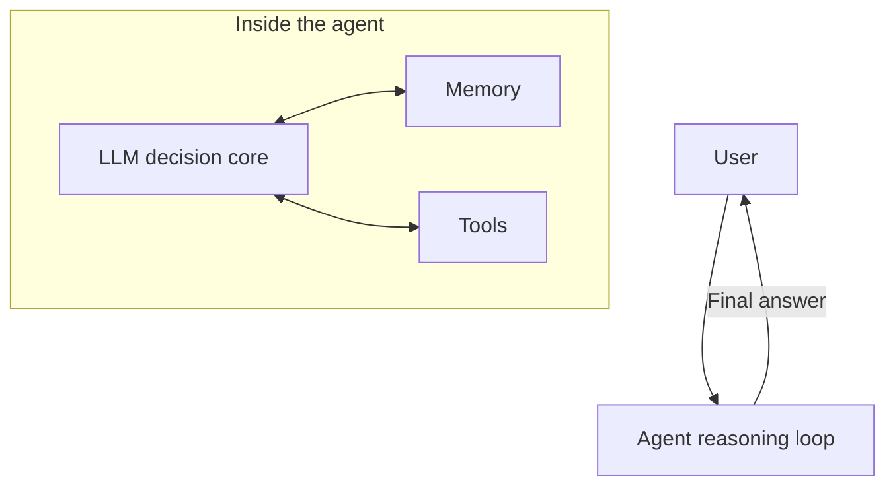
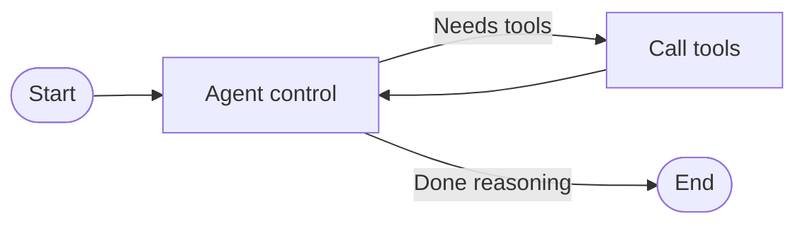

Notes from TensorOps ML engineer Clara Gadelho’s video [How to Create Your Own AI Agent - Tutorial with Clara Gadelho](https://www.youtube.com/watch?v=6Dvj4VZsscg): building a ReAct agent with tool use and memory (a travel assistant) on modern LLM frameworks.

<!--more-->

---

## 1. AI agents and the ReAct architecture

In modern LLM apps, an **agent** is an entity that can decide on its own, call external tools, and run multi-step tasks.

### ReAct (Reasoning and Acting)

ReAct is one of the most common agent architectures. The idea is to **alternate thinking and acting**:

1.  **Reasoning**: the model thinks about the user input, inspects state, and decides what to do next.
2.  **Acting**: if it needs external info, it calls **tools** (search, APIs, calculators, …).
3.  It folds tool results back into reasoning and loops until it can return a final answer.



### Three building blocks

*   **Tools**: bridge to the outside world — APIs, DB queries, or any Python function.
*   **Memory**: keep context and multi-turn history.
*   **Planning**: control the reasoning loop and graph flow.

---

## 2. Stack choices

This tutorial uses two libraries:

*   **LLM Studio**: TensorOps’ open-source model router/manager. A unified gateway so you can switch GPT-4o, Gemini, etc. without rewriting business code.
*   **LangGraph**: LangChain’s graph-based agent framework. Modular, with built-in state and loop control — simplifies complex setups (including multi-agent).

---

## 3. Build: a smart travel assistant

### Prerequisites

*   **Deps**: Python 3.10+, install `langchain`, `langgraph`, `requests`, `python-dotenv`, and `llm-studio`.
*   **API keys**:
    *   Model provider key (e.g. OpenAI).
    *   **Weatherbit** API key for live destination weather.
    *   **Tavily Search** API key for web search.

### Implementation steps

#### Step 1: Imports and LLM init

Use `llm-studio` as a router to OpenAI `gpt-4o`, wrapped for LangChain:

```python
import os
import sys
from dotenv import load_dotenv
from llm_studio import LLM  # LLM Studio

load_dotenv()

# Initialize the LLM router
llm = LLM(provider="openai")
model = llm.get_model("gpt-4o")
```

#### Step 2: Define tools

Three tools for trip planning:

1.  **Current system date** — so the agent knows “today” for relative booking dates.
2.  **Web search** — stock `TavilySearchResults`.
3.  **Weather** — Weatherbit API.

> **Important:** custom tools need a detailed **docstring**. At runtime the agent reads it to decide what the tool does and when to call it.

```python
from langchain_core.tools import tool
from langchain_community.tools.tavily_search import TavilySearchResults
from datetime import datetime

# 1. Current date
@tool
def get_system_date() -> str:
    """Get the current system date. Useful for calculating relative travel dates."""
    current_date = datetime.now().strftime("%Y-%m-%d")
    return f"The current date is: {current_date}"

# 2. Web search (cap results to avoid huge context)
web_search_tool = TavilySearchResults(max_results=3)

# 3. Weather (Weatherbit API)
@tool
def get_weather(location: str) -> str:
    """Fetch the weather forecast for a given location."""
    # (HTTP request/parse omitted)
    return f"Weather forecast for {location}: Sunny, 25°C."
    
tools = [get_system_date, web_search_tool, get_weather]
```

#### Step 3: ReAct agent + session memory

Assemble with LangGraph’s `create_react_agent`. `MemorySaver` persists dialogue state so the agent can reload history by `thread_id` across turns.

```python
from langgraph.prebuilt import create_react_agent
from langgraph.checkpoint.memory import MemorySaver

# System prompt (state modifier)
system_prompt = (
    "You are a helpful travel assistant. If given a duration for a trip, "
    "suggest a detailed daily itinerary with activities, meals, and accommodations. "
    "Include weather forecasts in your decisions and search the web for real-time flights or hotels. "
    "Make sure to provide direct links if you suggest booking."
)

memory = MemorySaver()

agent = create_react_agent(
    model=model,
    tools=tools,
    state_modifier=system_prompt,
    checkpointer=memory
)
```

#### Step 4: Visualize the graph

LangGraph can emit a Mermaid diagram of the topology:



---

## 4. Run and multi-turn tests

### Turn 1: plan a trip

Set `thread_id` to `1` and ask: “Plan a 3-day trip to Milan in two weeks. I’m traveling from Porto.”

```python
config = {"configurable": {"thread_id": "1"}}
inputs = {"messages": [("user", "Plan a 3-day trip to Milan that will happen in two weeks. I'm traveling from Porto.")]}

for event in agent.stream(inputs, config):
    # Print streaming events/messages
    pass
```

*   **Trace**:
    1.  Agent calls `get_system_date` to compute the exact travel date two weeks out.
    2.  Calls `get_weather("Milan")`.
    3.  Calls Tavily for Porto→Milan flights and hotel prices.
    4.  Combines everything into a detailed 3-day itinerary with booking links.

### Turn 2: test memory

Same `thread_id`: “Will Christmas markets be open when I go there?” (**no mention of Milan or dates**).

```python
inputs_2 = {"messages": [("user", "Will Christmas markets be open when I go there?")]}

for event in agent.stream(inputs_2, config):
    pass
```

*   **Result**: the agent recovers “Milan” and the travel window from memory, searches Milan Christmas market dates for that period, and answers accurately.

---

## 5. Takeaways

A production-shaped agent prototype with little code:

1.  **Minimal build**: `create_react_agent` hides graph/state plumbing so you can validate ideas quickly.
2.  **Docstrings as prompts**: tool docstrings act as model-facing instructions for *when* to call — prompt engineering still matters in the agent era.
3.  **Model gateway**: with `llm-studio`, swapping models costs far less when providers change.
