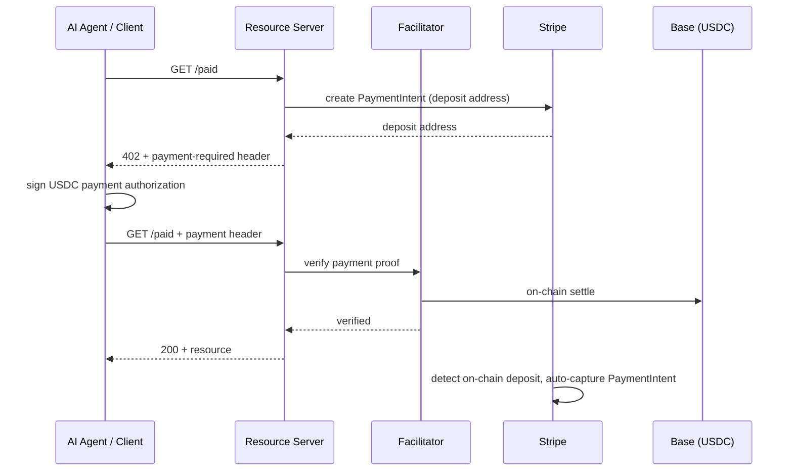
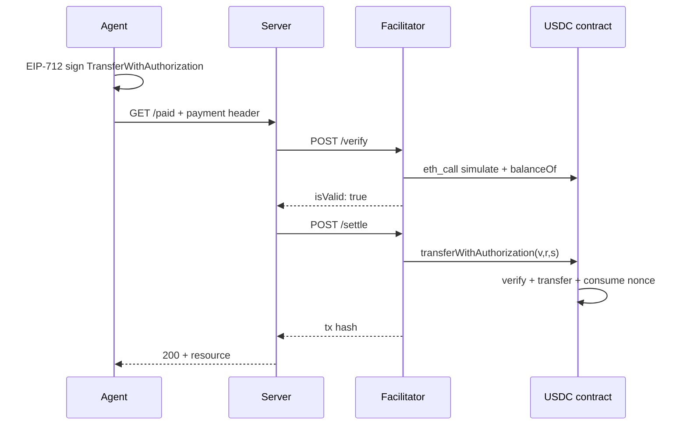

x402 is an open protocol for machine-to-machine (M2M) payments. The core idea is to **revive HTTP 402 “Payment Required”**: when an API returns a payment challenge, the client (especially an AI agent) can pay and retry automatically — no human in the loop, no pre-registered account.

In 2026 Stripe wired it into existing payment infrastructure: developers still use familiar PaymentIntents and the Dashboard, while settlement is USDC on-chain. Coinbase built Agent.market around the same protocol. This note combines BitKan write-ups, [Stripe’s docs](https://docs.stripe.com/payments/machine/x402), and sample code.

<!--more-->

## 1. Background: why x402?

Traditional API billing is hostile to AI agents:

| Model | Problem |
|------|------|
| API key + subscription | Agent must register and bind a card; no true pay-per-call |
| OAuth / accounts | Human identity flows; hard to automate |
| Direct on-chain transfer | Sign and confirm every tx; high latency, heavy integration |

x402 embeds payment in HTTP itself: server returns 402 + terms; client signs an authorization and retries with a `payment` header — **one HTTP round-trip for negotiation and settlement**. That fits $0.01 micropayments and 24/7 autonomous agents.

Coinbase open-sourced the protocol in 2025; the x402 Foundation (Coinbase + Cloudflare) maintains the spec. Stripe, Google, Cloudflare, and others ship compatible implementations.

## 2. Payment flow



Roles:

- **Resource Server**: your API — which routes are paid, price, payee address.
- **Facilitator**: third party that verifies payment proofs and settles on-chain (test: x402.org testnet facilitator; mainnet: [Coinbase CDP Facilitator](https://docs.cdp.coinbase.com)).
- **Stripe**: deposit-address lifecycle, PaymentIntent state, Dashboard reconciliation and compliance.

When unpaid, the server returns:

```http
HTTP/1.1 402 Payment Required
payment-required: eyJ4NDAyVmVyc2lvbiI6MiwiZXJyb3IiO...
```

The `payment-required` header is base64 JSON: amount, network, payee address, scheme, etc.

## 3. Facilitator: verify and settle on-chain

The **Facilitator** verifies the client’s payment proof and, if valid, **settles on-chain**. The Resource Server does not run a full node, verify signatures, or broadcast txs — it delegates via `HTTPFacilitatorClient`.

### 3.1 Place in the architecture

| Role | Responsibility |
|------|------|
| **Resource Server** | Declare price, return 402, protect paid routes |
| **Facilitator** | Verify signatures, settle on-chain, attest “payment valid” to the server |
| **Stripe** (optional) | Deposit addresses, watch deposits, capture PaymentIntent, Dashboard |

Facilitator owns **protocol-layer on-chain settlement**; Stripe owns **merchant-side recognition of funds**. Different jobs; Stripe’s x402 integration usually uses both.

Common facilitators: x402.org testnet; mainnet [Coinbase CDP](https://docs.cdp.coinbase.com) (`https://api.cdp.coinbase.com/platform/v2/x402`). The protocol is open — you can self-host.

### 3.2 Crypto basis: EIP-3009 + EIP-712

Verification and settlement rest on USDC’s **EIP-3009 (`TransferWithAuthorization`)** and **EIP-712** (typed data signing):

- The agent **only signs an authorization** — it does **not** send the on-chain tx and **does not need ETH for gas**
- After verify, the Facilitator pays gas and calls the USDC contract

After a 402, the agent wallet EIP-712-signs `TransferWithAuthorization`, e.g.:

```json
{
  "from": "0xAgentWallet...",
  "to": "0xDepositAddress...",
  "value": "10000",
  "validAfter": "1740672089",
  "validBefore": "1740672154",
  "nonce": "0xf3746613..."
}
```

Signing includes a **domain separator** (contract address, chainId, token name `"USD Coin"`, etc.) so the signature cannot be replayed on another chain/contract. The result is base64’d into the HTTP `payment` header for the retry.

### 3.3 Two standard APIs: `/verify` and `/settle`

The [x402 spec](https://github.com/coinbase/x402/blob/main/specs/x402-specification-v2.md) defines Facilitator HTTP APIs; `x402ResourceServer` calls them via `HTTPFacilitatorClient`:

| Endpoint | Role |
|------|------|
| `POST /verify` | Verify + preflight — **no chain write** |
| `POST /settle` | After verify — **broadcast on-chain tx** |
| `GET /supported` | Supported schemes and networks |

The server sends the decoded `payment` payload plus the original `paymentRequirements` (amount, address, network from the 402).

#### `/verify` checks (exact scheme / EVM)

Per [scheme_exact_evm](https://github.com/x402-foundation/x402/blob/main/specs/schemes/exact/scheme_exact_evm.md):

1. `ecrecover` signer → must equal `authorization.from`
2. On-chain `balanceOf(from)` → balance ≥ `value`
3. `authorization.value` == `paymentRequirements.amount` (exact)
4. `authorization.to` == `paymentRequirements.payTo`
5. Now within `[validAfter, validBefore]`
6. `nonce` unused (anti-replay)
7. Token contract and network match requirements
8. `eth_call` simulate `transferWithAuthorization(...)` → must succeed

Success: `{ "isValid": true, "payer": "0x..." }`. Failures: `invalid_signature`, `insufficient_funds`, `nonce_already_used`, etc.

#### `/settle` on-chain

Facilitator’s wallet (holds ETH for gas) calls USDC:

```solidity
USDC.transferWithAuthorization(
    from, to, value,
    validAfter, validBefore, nonce,
    v, r, s   // from payload.signature
);
```

The contract re-verifies the signature, checks nonce, `transfer(from → to, value)`, and consumes the nonce. Returns the tx hash.



`paymentMiddleware` wraps verify/settle in the request path; developers rarely call these APIs directly.

### 3.4 Security properties

Spec: the **Facilitator cannot change amount or payee** — it only broadcasts; `to` and `value` are fixed in the signature; the contract executes exactly that.

| Mechanism | Prevents |
|------|--------|
| EIP-712 domain (chainId + contract) | Cross-chain / cross-contract replay |
| One-time nonce | Paying twice with the same auth |
| `validBefore` window | Abuse of expired auths |
| Exact scheme | Amount must match exactly |
| `eth_call` simulation | Broadcasting doomed txs |

In Stripe’s integration: Facilitator moves USDC Agent → Stripe deposit address; Stripe watches that address and captures the matching PaymentIntent.

## 4. Stripe implementation notes

### 4.1 Relation to the open protocol

Two distinct layers:

- **x402 protocol**: open HTTP 402 handshake, Apache 2.0, vendor-neutral.
- **Stripe Machine Payments**: hosted layer — deposit addresses, chain monitoring, PaymentIntent capture, refunds, Dashboard reporting.

Stripe also has **MPP (Machine Payments Protocol)** — session-based streaming charges for high-frequency continuous billing. x402 is **exact per-request** payment. Both can coexist; pick by scenario.

### 4.2 Why create a PaymentIntent?

The “Server → Stripe: create PaymentIntent” step is easy to question: x402 only needs amount + payee in the 402 — why not a static wallet?

**Core reason: Stripe must map an on-chain USDC transfer to a trackable Stripe order.**

Pure x402 (Coinbase-native) can use a static `payTo: "0xYourWallet"`; Facilitator verifies and settles with no payment gateway. With Stripe, **PaymentIntent + deposit address** is the integration — that extra step buys Dashboard reconciliation, auto-capture, and refunds.

#### Dynamic per-intent deposit address

`paymentIntents.create` returns `deposit_addresses.base.address` — allocated for **this** PaymentIntent, not a fixed merchant wallet. After the agent sends USDC there, Stripe detects the deposit, **captures** the PI, and funds land in Stripe balance.

#### Into Stripe’s ledger

| Without PaymentIntent | With PaymentIntent |
|----------------|------------------|
| Agent pays some address | Agent pays Stripe-allocated address |
| You scan the chain yourself | Stripe auto-detects and captures |
| No Dashboard record | Visible under Payments |
| Refunds DIY | Stripe refund flows |

The PI `amount` also binds expected USDC so deposit detection can check the right amount and avoid under/overpay chaos.

#### Anti-forged payee

On retry, `createPayToAddress` decodes `authorization.to` from the `payment` header and compares to server cache — only addresses **this server recently created via Stripe** are valid. Attackers cannot stuff a random address into the payment header.

#### vs pure x402

```
Pure Coinbase x402:  payTo = static wallet → Facilitator verify → done
Stripe x402:         payTo = PI dynamic address → Facilitator verify → Stripe capture PI → done
```

In short: **`payTo` in the 402 is not a random wallet — it is Stripe saying “pay this address and I will recognize the funds.”**

### 4.3 Stack

| Component | Role |
|------|------|
| `@x402/hono` / `@x402/express` | Framework middleware: intercept routes, return 402, validate `payment` |
| `@x402/core/server` | `HTTPFacilitatorClient`, `x402ResourceServer` |
| `@x402/evm/exact/server` | EVM “exact amount” scheme |
| Stripe SDK `2026-03-04.preview` | Create crypto PaymentIntent, get deposit address |

### 4.4 `createPayToAddress`: dynamic payee

Under Stripe, `payTo` is not a hardcoded wallet — it is an **async function**:

1. **First request**: `stripe.paymentIntents.create` with `payment_method_types: ["crypto"]`, `mode: "deposit"`, `networks: ["base"]`; read address from `next_action.crypto_display_details.deposit_addresses.base.address`.
2. **Retry / verify**: decode `authorization.to` from `payment` and match cache — block forged payees.
3. **Cache**: sample uses `node-cache` (TTL 5 min); production should use Redis (or similar).

```typescript
const paymentIntent = await stripe.paymentIntents.create({
  amount: amountInCents,
  currency: "usd",
  payment_method_types: ["crypto"],
  payment_method_data: { type: "crypto" },
  payment_method_options: {
    crypto: {
      mode: "deposit",
      deposit_options: { networks: ["base"] },
    },
  },
  confirm: true,
});
```

After on-chain deposit, Stripe auto-captures the PaymentIntent into Stripe balance.

### 4.5 Middleware config

```typescript
app.use(
  paymentMiddleware(
    {
      "GET /paid": {
        accepts: [{
          scheme: "exact",           // exact amount
          price: "$0.01",            // $0.01 per request
          network: "eip155:84532",   // Base Sepolia
          payTo: createPayToAddress, // dynamic address
        }],
        description: "Data retrieval endpoint",
        mimeType: "application/json",
      },
    },
    new x402ResourceServer(facilitatorClient).register(
      "eip155:84532",
      new ExactEvmScheme(),
    ),
  ),
);
```

Networks use [CAIP-2](https://github.com/ChainAgnostic/CAIPs/blob/master/CAIPs/caip-2.md): `eip155:84532` (Base Sepolia), `eip155:8453` (Base mainnet).

### 4.6 Supported networks and tokens

Stripe crypto PaymentIntent (deposit mode) currently supports:

| Network | Token | Contract |
|------|------|----------|
| Base | USDC | `0x833589fCD6eDb6E08f4c7C32D4f71b54bdA02913` |
| Solana | USDC | `EPjFWdd5AufqSSqeM2qN1xzybapC8G4wEGGkZwyTDt1v` |
| Tempo | USDC | `0x20c000000000000000000000b9537d11c60e8b50` |

### 4.7 Prerequisites

1. Stripe account with **Stablecoins and Crypto** enabled (Dashboard application; US merchants; customers worldwide can pay with stablecoins).
2. Env: `STRIPE_SECRET_KEY`, `FACILITATOR_URL`.
3. API version: `2026-03-04.preview`.

Test: `curl -iv http://localhost:4242/paid` without a payment header should return 402; Stripe’s `purl` can simulate the full client flow. Sandbox does not watch testnet chain activity — use test helpers to simulate deposits.

## 5. Coinbase side: Agent.market and the agent economy

Coinbase’s x402 ecosystem launched **[Agent.market](https://agent.market)** — a unified AI agent app store for inference, data, search, media, infra, social, trading, and more.

**How the agent economy works:**

- **Usage billing**: agents pay in real time for API calls, data, compute.
- **Subscriptions**: monthly/volume plans for high-frequency workloads.
- **Agentic Premium**: tiered pricing for high-value AI services.

**Integrations** include OpenAI, Bloomberg, CoinGecko, LinkedIn, X, AWS Lambda, etc. — agents can chain tools on one platform.

**Scale (early 2026 reports):** ~69,000 active agents, 165M+ transactions, ~$50M volume. Stripe’s entry pushes x402 from crypto-native niches into mainstream payment rails.

## 6. x402 vs other agent payment options

| Dimension | x402 | Stripe MPP | Traditional API key |
|------|------|------------|--------------|
| Granularity | Per-request micropay | Streaming within a session | Subscription / quota |
| Openness | Open protocol, many facilitators | Stripe-hosted | Per-platform proprietary |
| Identity | Wallet signature | Stripe accounts | Register + key |
| Compliance / books | DIY or Stripe layer | Built into Dashboard | Platform-owned |
| Typical use | Single API call at $0.01 | Long agent sessions | Human developers |

Google’s Pay.sh (Solana + x402 SDK) is another path: proxy HTTP, inject 402 handshake, settle in Solana USDC — fits agents already on Google Cloud.

## 7. Opportunities and challenges

**Opportunities:**

- Agents as economic actors — buy compute, data, and tools 24/7.
- USDC for price stability; Base for low gas and sub-second confirmation.
- Monetize existing HTTP APIs with middleware — no full rewrite.

**Challenges:**

- Refunds and disputes: no mature pattern for fully automated flows yet.
- Compliance: sanctions screening, KYC/AML need extra design on pure on-chain paths.
- Security: dynamic deposit-address cache, Facilitator trust, agent wallet key management.
- Test vs mainnet: sandbox does not watch testnets; mainnet needs a mainnet-capable Facilitator.

## 8. Minimal runnable layout

```
stripe-samples/machine-payments/
├── server.ts          # Hono + paymentMiddleware + Stripe PI
├── .env               # STRIPE_SECRET_KEY, FACILITATOR_URL
└── package.json       # @x402/hono, @x402/core, @x402/evm, stripe
```

Dependency shape:

```
paymentMiddleware(routes, x402ResourceServer)
    ├── routes: pricing + payTo resolution
    ├── x402ResourceServer: register network → scheme handler
    └── HTTPFacilitatorClient: Facilitator verify / settle
```

## 9. Conclusion

x402 turns the paywall into a native HTTP capability: the server says “402, pay $0.01 USDC first”; the agent signs, pays, and retries — no human click. Stripe’s value is **absorbing ops complexity with PaymentIntents and the Dashboard** (addresses, deposit detection, capture, reporting) while developers keep familiar Stripe workflows. Coinbase extends the protocol into a discoverable, billable agent service market via Agent.market.

For builders of autonomous agents, x402 is one of the lightest pay-per-call API paths today; if you are already on Stripe, the official quickstart can run a Base Sepolia flow in a few dozen lines.

## References

- [Stripe x402 Quickstart](https://docs.stripe.com/payments/machine/x402/quickstart)
- [Stripe x402 overview](https://docs.stripe.com/payments/machine/x402)
- [BitKan: What is Stripe’s x402 protocol](https://bitkan.com/zh/learn/%E4%BB%80%E4%B9%88%E6%98%AFstripe%E7%9A%84x402%E5%8D%8F%E8%AE%AE-%E5%AE%83%E5%A6%82%E4%BD%95%E5%AE%9E%E7%8E%B0ai%E4%BB%A3%E7%90%86%E6%94%AF%E4%BB%98-71597)
- [BitKan: Coinbase x402 agent marketplace](https://bitkan.com/zh/learn/coinbase-x402-%E4%BB%A3%E7%90%86%E5%B8%82%E5%9C%BA%E8%A7%A3%E6%9E%90-%E5%85%B6%E4%BB%A3%E7%90%86%E7%BB%8F%E6%B5%8E%E5%A6%82%E4%BD%95%E8%BF%90%E4%BD%9C-73420)
- [stripe-samples/machine-payments](https://github.com/stripe-samples/machine-payments)
- [x402 specification v2](https://github.com/coinbase/x402/blob/main/specs/x402-specification-v2.md)
- [exact scheme on EVM](https://github.com/x402-foundation/x402/blob/main/specs/schemes/exact/scheme_exact_evm.md)
