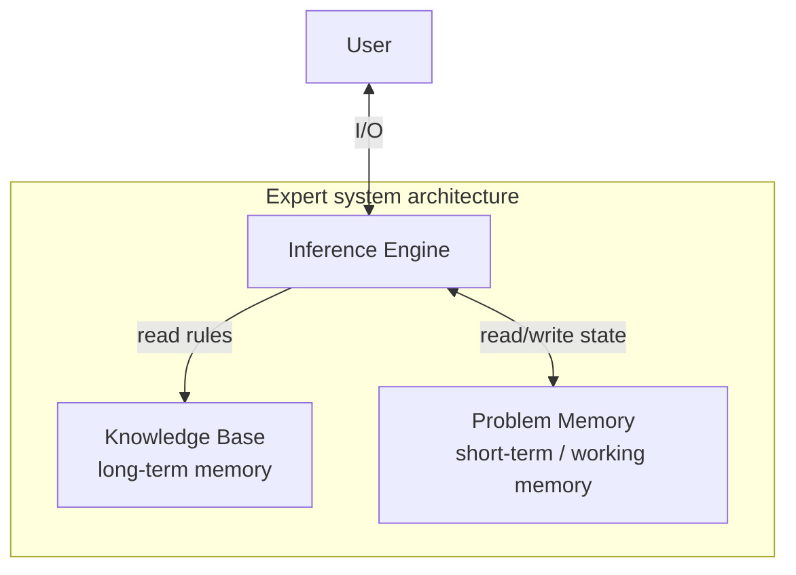

Notes from Chapter 2 of Microsoft’s [AI-For-Beginners](https://github.com/microsoft/AI-For-Beginners): **Symbolic AI** — expert systems, knowledge representation, forward/backward inference, ontologies, and the Semantic Web.

<!--more-->

## 1. Knowledge vs information / data

In symbolic AI (top-down), the idea is to turn human knowledge into a machine-readable form and use it to solve problems.

### DIKW pyramid

To define “knowledge,” the **DIKW pyramid** is often used:

*   **Data**: symbols, text, or sound on a physical medium (books, web pages). Exists independently of people and can be transferred.
*   **Information**: how a human mind interprets and understands data.
*   **Knowledge**: information integrated into an individual’s active world model — gained through **learning**, as a network of related concepts.
*   **Wisdom**: higher-level understanding — **meta-knowledge** about how and when to use knowledge.

---

## 2. Knowledge representation

The goal is to store knowledge as **data** so a computer can use it automatically. Methods sit on a spectrum:

*   **Left (simple / algorithmic)**: e.g. encode as program code — easy for machines, very inflexible.
*   **Right (natural language)**: richest expression — hard for machines to reason over directly.

### Categories

#### Network representations

*   **Semantic network**: graph of related concepts, mirroring how ideas link in the mind.
*   **Object–Attribute–Value (OAV) triplets**: graphs as nodes and edges; build the network from triples.
    *   *Examples*:
        *   `Python` - `is` - `Untyped-Language`
        *   `Python` - `invented-by` - `Guido van Rossum`

#### Hierarchical representations

*   **Frames**: classify things like humans do. Each object/class is a **frame** with **slots**.
    *   Slots can have defaults, constraints, or procedures on access (similar to OOP classes/properties).
*   **Scenarios**: special frames for complex situations that unfold over time.

#### Procedural representations

*   **Production rules**: `IF-THEN` causal logic.
    *   *Example*: `IF animal eats meat OR (sharp teeth AND claws AND forward-facing eyes) THEN animal is a carnivore`.
*   **Algorithms**: procedural, but rarely used directly in knowledge-base systems.

#### Logic

*   **Predicate logic**: too heavy to compute fully; systems usually use a subset (e.g. Horn clauses in Prolog).
*   **Description Logic (DL)**: hierarchies of objects; theoretical foundation of the Semantic Web.

---

## 3. Expert systems

**Expert systems** were an early success of symbolic AI: act as a human expert in a narrow domain.

### Architecture

Mirrors human long-term / working memory and reasoning:

*   **Knowledge base**: long-term knowledge extracted from experts.
*   **Problem memory**: current problem data and state (short-term / working memory).
*   **Inference engine**: reasons over the knowledge base and problem memory.



### Inference styles

#### Forward inference

Start from known data and derive conclusions.

1.  **Conflict set**: find all rules whose conditions currently hold.
2.  **Conflict resolution**: pick one rule (first match, random, most specific, etc.).
3.  **Apply**: fire the rule; add new facts (triples) to working memory.
4.  **Loop** until the goal attribute is obtained.

#### Backward inference

Goal-driven: work backward from a hypothesis.

1.  **Goal**: find rules that conclude the goal.
2.  **Prove conditions**: unknown left-hand conditions become recursive sub-goals.
3.  **Ask the user**: if an attribute cannot be derived, query the user.
4.  **Backtrack**: if the current hypothesis fails, try other candidate rules.

> **Explainability** is a strength of knowledge-based expert systems: every decision can be traced through the rules that fired.

---

## 4. Ontologies and the Semantic Web

### Semantic Web stack

Late 20th century: annotate web resources with knowledge-representation tech for precise retrieval.

*   **Description Logic (DL)** for formal semantics
*   Global **URIs** for concepts — distributed knowledge across the web
*   XML family: **RDF**, **RDFS**, **OWL (Web Ontology Language)**

### Ontology

An ontology is an **explicit specification** of a domain. Simplest form: a taxonomy; richer forms add inference rules.

*   **Triples** are the core. Example — “AI course created by Dmitry in 2022”:
    *   `course-url` - `creator` - `author-homepage`
    *   `course-url` - `creation-date` - `"Jan 1, 2022"`

### Notable projects

*   **WikiData**: machine-readable KB from Wikipedia infoboxes; query with **SPARQL**
*   **DBpedia**: similar Wikipedia extraction project
*   **Protégé**: Stanford’s visual ontology editor

### Case study: family ontology inference

[FamilyOntology.ipynb](https://github.com/microsoft/AI-For-Beginners/blob/main/lessons/2-Symbolic/FamilyOntology.ipynb) shows Semantic Web tech for family relations:

*   **Source**: `python-gedcom` reads Romanov GEDCOM (`data/tsars.ged`).
*   **Ontology (`onto.ttl`)**: Turtle rules for kinship. Base relations: `isFatherOf`, `isMotherOf`, `isBrotherOf`, `isSisterOf`; richer relations via chains.
    *   e.g. **aunt** = *parent’s sister*, as an OWL `propertyChainAxiom`:
        ```turtle
        fhkb:isAuntOf a owl:ObjectProperty ;
            rdfs:domain fhkb:Woman ;
            rdfs:range fhkb:Person ;
            owl:propertyChainAxiom ( fhkb:isSisterOf fhkb:isParentOf ) .
        ```
*   **Inference and closure**:
    1. Walk GEDCOM → gender and kinship triples → append to the ontology.
    2. Load the graph with `rdflib`.
    3. Expand with `owlrl`: `DeductiveClosure(OWLRL_Extension).expand(g)` to materialize implied relations.
*   **Query**: SPARQL over the expanded graph (e.g. `SELECT ?aname ?bname WHERE { ?a fhkb:isUncleOf ?b ... }`) returns uncle pairs without hand-written search logic.

---

## 5. Concept graphs and theme classification

*   **Auto-built**: unlike hand-authored ontologies, mined from unstructured text (e.g. natural language).
*   **Probabilistic `is-a`**: e.g. “Microsoft” is a `company` with probability 0.87, a `brand` with 0.75 — a probabilistic model of human concepts.

### Case study: news theme classification

[MSConceptGraph.ipynb](https://github.com/microsoft/AI-For-Beginners/blob/main/lessons/2-Symbolic/MSConceptGraph.ipynb):

*   **API note**: Microsoft Concept Graph API is gone; the sample now uses **ConceptNet** (conceptnet.io) REST — 8M+ nodes, 21M+ edges, multilingual relations like `IsA`, `PartOf`, `UsedFor`.
*   **Pipeline**:
    1.  **Headlines**: fetch UK/US headlines via `NewsApi.org`.
    2.  **Noun phrases**: extract with `TextBlob`.
    3.  **Abstraction**: classifying raw phrases is too sparse; for each phrase, query ConceptNet `IsA` for parent concepts (`company`, `person`, `nation`, `economy`, …) with normalized weights.
    4.  **Aggregate**: if parent weight > threshold (0.1), assign themes like `ECONOMY`, `NATION`, `PERSON`.
*   **Value**: **no supervised labels** — no trained classifier. Relies on a common-sense knowledge graph for theme clustering of unseen headlines — symbolic AI’s strength in abstraction and semantic generalization.

## 6. Takeaways

Even with deep learning dominant, symbolic AI’s **explicit reasoning** still matters:

1.  Neural nets often lack **explainability**; symbolic systems can show the rule chain.
2.  When behavior must be controlled or **100% logic constraints** must hold, knowledge bases and inference engines remain essential.
