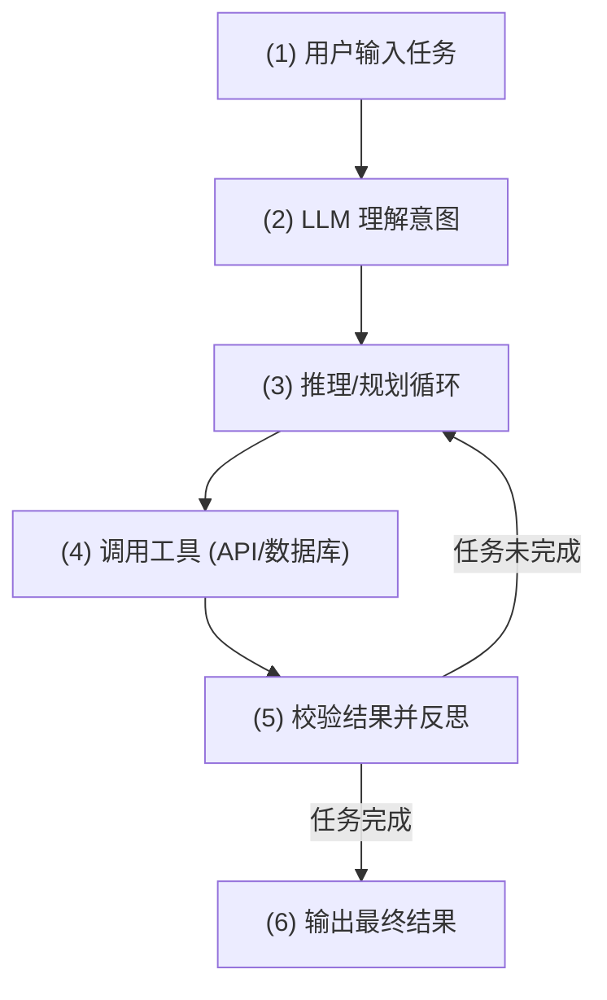

本篇笔记基于 Vellum.ai 发布的行业深度指南 [The ultimate LLM agent build guide](https://www.vellum.ai/blog/the-ultimate-llm-agent-build-guide) 进行整理，系统性地梳理了构建生产级大语言模型智能体 (LLM Agent) 的核心要素、内存管理、上下文工程、工具集成方案（Function Calling 与 MCP）、主流架构设计模式（单线程 vs. 多智能体）以及从原型到生产线的落地实践步骤。

<!--more-->

## 一、 背景与现状 (Why this matters)

在生成式 AI (GenAI) 蓬勃发展的当下，根据 MIT 的研究报告，**约 95% 的 GenAI 试点项目最终未能走向生产线**。许多企业发现 AI 研发是一项高投入但产出不稳定的尝试，其核心瓶颈在于缺乏**可靠、实用且稳定**保持的 Agent 设计与工程实现方法。

随着 LLM 市场的快速增长，IBM 调查显示 **99% 构建企业 AI 应用的开发者都在探索或开发 AI Agent**。构建实用且高可靠性的 Agent 已经成为 AI 落地的关键一环。

---

## 二、 什么是 LLM Agent？

LLM Agent 的本质是**利用 LLM 在循环中调用工具并做决策的自主系统**。智能体的自主性存在一个光谱：

*   **低自主性（简单流程）**：例如一个简单的笔记生成器，仅需 1~2 个工具和最基本的线性规划。
*   **高自主性（复杂任务）**：例如深度研究智能体，其依赖多智能体（Multi-agent）协作、并行子任务拆解及反思迭代逻辑。

### 1. 核心工作原理
Agent 的基本运作循环如下：



以“预订纽约到旧金山的机票”为例：
1.  **用户任务**：“帮我订一张明天从纽约到旧金山的机票。”
2.  **大模型理解**：识别出需要搜索机票、对比价格、进行预订。
3.  **推理规划**：Step 1 搜索航班 -> Step 2 筛选最优解 -> Step 3 预订。
4.  **工具调用**：调用航班搜索 API 获取实时数据，再调用支付与日历 API。
5.  **校验结果**：读取 API 返回，确认扣款成功，验证航班无误。
6.  **完成任务**：返回确认信息：“您的航班已订好，已同步至日历。”

---

## 三、 Agent 运行的四大支柱

要让 Agent 在生产环境中具备高可靠性，必须针对其**四大支柱（模型、内存、上下文、工具）**实施针对性的 guardrails（护栏）和控制。

| 支柱 | 核心要素 | 生产环境最佳实践 |
| :--- | :--- | :--- |
| **Model (大模型)** | 基础底座与规则 | 设置合理的温度值 (Temperature)、最大 Token 限制及步骤计数上限；系统提示词 (System Prompt) 须明确定义角色、风格、工具调用条件及求助边界。 |
| **Memory (内存)** | 短期与长期记忆 | **短期记忆**：仅保留单次调用最关键的上下文，限制 Token，在重注入前对工具输出进行结构化净化。<br>**长期记忆**：分类为事件记忆 (Episodic)、通用知识 (Semantic) 和用户偏好 (User-specific)，并实施 TTL 自动过期机制。 |
| **Context (上下文)** | 信息可见性控制 | 定义严格的状态 Schema，每轮迭代主动剪枝掉过期、无关或冗余信息，引入成本和 Token 尺寸的双重监控守护。 |
| **Tools (工具)** | 外部能力的延伸 | 采用严格 of JSON 校验机制，实施重试与指数退避算法，支持幂等操作，提供合理的超时限制，在 MCP 中配置严密的权限与限流。 |

---

## 四、 内存管理机制 (Memory Management)

内存是 Agent 保证上下文连贯性、个性化决策以及多轮推理的基础。

```
                    ┌─────── 内存系统 (Memory System) ───────┐
                    │                                        │
           ┌────────┴────────┐                      ┌────────┴────────┐
           ▼                 ▼                      ▼                 ▼
     短期内存 (Short-term)                     长期内存 (Long-term)
   (单次 LLM Call 上下文)                          (持久化跨 Session)
                                                    │
                                   ┌────────────────┼────────────────┐
                                   ▼                ▼                ▼
                             事件记忆 (Episodic)  语义记忆 (Semantic)  用户特有记忆 (User)
```

1.  **短期内存 (Short-Term Memory)**：
    *   **定义**：单次大模型调用时传入的上下文，在单次 Session 内流转，随会话结束而清理。
    *   **例子**：用户输入“总结这篇文章”，随后输入“改成列表形式”，“改成列表形式”能生效依赖于短期内存中的文章上下文。
2.  **长期内存 (Long-Term Memory)**：
    *   **事件记忆 (Episodic Memory)**：持久化存储过去发生过的事实或对话历史（例如：“用户在6月2日查询了伦敦的酒店”）。
    *   **语义记忆 (Semantic Memory)**：不随时间变化的通用知识或事实。通常以向量数据库（非结构化事实/文档）或知识图谱（结构化数据）存储。
    *   **用户特有记忆 (User-Specific Memory)**：用户的个人偏好、特有历史配置（例如：“该用户在7月13日曾对比了 UA 756 和 UA 459 航班价格”）。

---

## 五、 工具集成方案：Function Calling vs. MCP

Agent 调用工具通常有两种实现路线：

```
Function Calling (直接连线)      Model Context Protocol (通用适配器)
┌─────────┐      ┌──────┐       ┌─────────┐      ┌───────────┐      ┌──────┐
│   LLM   ├─────►│ Tool │       │   LLM   ├─────►│    MCP    ├─────►│ Tool │
└─────────┘      └──────┘       └─────────┘      │Client/Host│      └──────┘
                                                 └───────────┘
```

### 1. 概念对比
*   **Function Calling（函数调用）**：
    *   **原理**：大模型不会直接执行函数。开发者需要事先向模型描述函数 Schema，模型决定是否调用，并以 JSON 格式输出所需参数。开发者的系统拦截该 JSON，本地执行函数，最后将结果送回 LLM。
    *   **局限**：属于点对点连接，每个新工具都需要手写定制对接代码，扩展性差。
*   **Model Context Protocol（MCP，模型上下文协议）**：
    *   **原理**：Anthropic 推出的一种大模型与外部数据/工具通信的标准协议。它充当通用适配器，一次定义，即可被任何兼容 MCP 的模型和平台复用。

### 2. 选型建议

| 维度 | Function Calling (函数调用) | MCP (模型上下文协议) |
| :--- | :--- | :--- |
| **最适合场景** | 快速、低延迟、特定的单任务工具调用 | 标准化集成大量工具/数据源，跨模型共享工具 |
| **主要优点** | 链路简单，延迟低，控制精细 | 一次声明到处使用，天然自带鉴权、版本控制和可观测性 |
| **主要缺点** | 扩展性差，难以维护多套工具集 | 初次配置成本较高，存在协议适配开销 |
| **混合模式 (Combined)**| **最佳实践**：关键核心链路采用 Function Calling 保证延迟；而外围广泛的第三方应用或复杂数据源通过 MCP 网关统一接入，兼顾速度与扩展性。 |

---

## 六、 智能体架构模式对比 (Architecture Patterns)

构建 Agent 时，选择**单线程智能体**还是**多智能体系统**是影响生产稳定性的关键决策。

### 1. 多智能体系统 (Multi-Agent Systems)
*   **定义**：在主智能体 (Lead Agent) 的统筹协调下，多个**专注于垂直领域**的子智能体 (Sub-agents) 协作解决问题。
*   **代表案例**：Anthropic 研究展示，通过一个 Opus 4 主智能体配合多个并行工作的 Sonnet 4 垂直子智能体，在深度研究评估中，**表现超越单个 Opus 智能体 90.2%**，其中 Token 算力资源消耗与成效表现（BrowseComp 分析）呈显著正相关。
*   **最适用场景**：开放式深度研究、需要多路并行检索/工具调用的超大上下文任务、以及流程无法硬编码的动态探索工作。

### 2. 单线程智能体 (Single-Threaded Agents)
*   **定义**：智能体以单线程、线性或单循环模式运行。每一次动作都在完全相同的上下文链路 and 决策栈下进行。
*   **倡导者 (如 Cognition/Devika)**：极力推荐在生产环境中使用单线程架构，因为其天然具备：
    *   **上下文无缝共享**：无跨智能体间的信息断层。
    *   **决策一致性**：避免了子智能体因并行运行而导致的逻辑冲突。
    *   **高可靠性**：编排链路极简，大幅减少了脆弱的死锁或死循环几率。
*   **最适用场景**：逻辑紧密耦合的任务（如代码生成/修改）、实时客服/助理聊天、小范围或短时效的任务。

---

## 七、 落地构建的 8 个步骤

1.  **明确目标与 PRD**：详细定义业务问题、用户痛点、KPI（如准确率、延迟、成本约束）和验收标准。
2.  **选择大模型与基础护栏**：选择最合适的模型（如推理选 Claude 3.5 Sonnet 或 GPT-4，成本选 GPT-4o-mini 或 Haiku），设置温度与上限阈值。
3.  **确立智能体架构**：根据任务复杂度确定单线程或多智能体体系，避免过度设计。
4.  **构建控制循环**：实现经典的“思考 (Thought) ➔ 行动 (Action) ➔ 观察 (Observation)”控制环，并为 Flaky 工具提供指数退避重试逻辑。
5.  **设计内存与上下文规则**：规范短期暂存区（Scratchpad）与长期存储，并设计相关的检索和清理策略。
6.  **集成外部工具**：基于应用场景选择 Function Calling 或 MCP，或者两者混合，确保接口的安全鉴权和限流监控。
7.  **接入评测与监控**：建立端到端评估系统，跟踪核心指标，设立安全回滚路径与人工介入机制（Human-in-the-loop）。
8.  **分阶段灰度发布**：从沙盒小规模试点开始，监控 SLO 和用户反馈，逐步扩大受众规模。

---

## 八、 选型决策 (Build vs. Buy)

企业在选择研发方案时，需权衡“**自行搭建**”还是“**购买平台/框架**”：

*   **自行搭建 (Raw APIs)**：适用于极度受限的高监管行业、对数据隐私有极端要求或对底层编排有极致定制需求的团队，但研发成本极高、维护周期长。
*   **使用框架 (Frameworks)**：提供底层抽象。
    *   **LangGraph**：基于图与状态的设计，在需要深度定制复杂逻辑时最为稳健。
    *   **CrewAI / AutoGen**：适用于快速搭建、以角色扮演与协作对话驱动的智能体网络原型。
*   **使用平台 (Platforms)**：
    *   **Vellum**：专为开发者和团队打造，提供完整的 Prompt 管理、自动化评估 (Evals)、发布版本控制以及可观测性体系，最适合需要快速推向生产且需要持续治理的团队。
    *   **n8n / Zapier**：面向低代码或业务自动化流。
