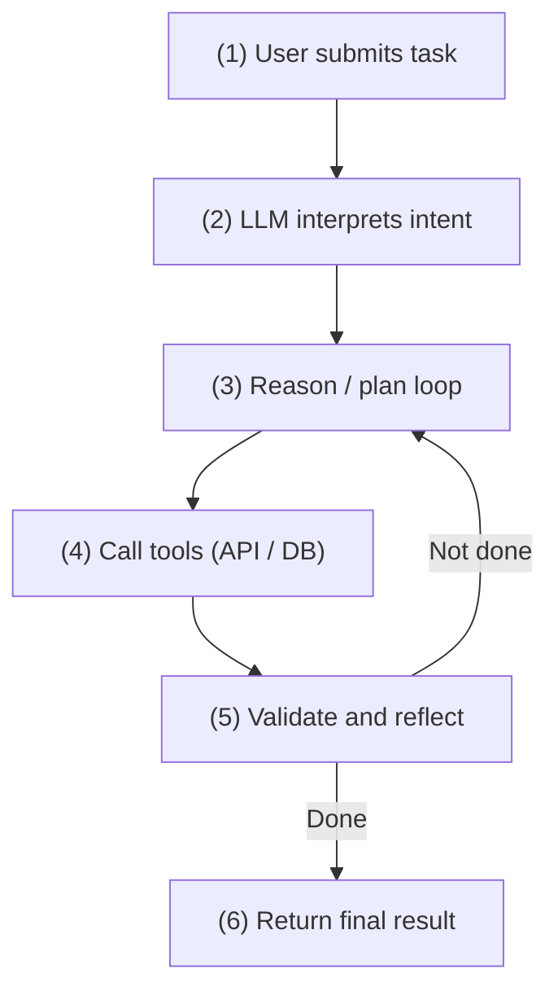

Notes from Vellum.ai’s industry guide [The ultimate LLM agent build guide](https://www.vellum.ai/blog/the-ultimate-llm-agent-build-guide): production LLM agents — core building blocks, memory, context engineering, tool integration (Function Calling vs MCP), architecture patterns (single-threaded vs multi-agent), and a path from prototype to production.

<!--more-->

## 1. Background (Why this matters)

Despite GenAI’s growth, MIT research finds **~95% of GenAI pilots never reach production**. Many orgs treat AI R&D as high spend with unstable returns; the bottleneck is lacking **reliable, practical, durable** agent design and engineering.

As the LLM market grows, an IBM survey reports **99% of developers building enterprise AI apps are exploring or building AI agents**. Practical, high-reliability agents are now central to shipping AI.

---

## 2. What is an LLM agent?

An LLM agent is an **autonomous system that uses an LLM in a loop to call tools and make decisions**. Autonomy is a spectrum:

*   **Low autonomy (simple flows)**: e.g. a note generator — 1–2 tools and basic linear planning.
*   **High autonomy (complex tasks)**: e.g. deep-research agents — multi-agent collaboration, parallel subtasks, and reflection/iteration.

### Core loop



Example — “Book a flight from NYC to SFO”:

1.  **User task**: “Book a flight from New York to San Francisco for tomorrow.”
2.  **Model understanding**: search flights, compare prices, book.
3.  **Plan**: Step 1 search → Step 2 pick best → Step 3 book.
4.  **Tools**: flight-search API, then payment and calendar APIs.
5.  **Validate**: confirm charge succeeded and itinerary is correct.
6.  **Done**: “Your flight is booked and synced to your calendar.”

---

## 3. Four pillars of a production agent

Reliability in production needs guardrails on four pillars: **model, memory, context, tools**.

| Pillar | Focus | Production practices |
| :--- | :--- | :--- |
| **Model** | Base model and rules | Sensible temperature, max tokens, step limits; system prompt must define role, style, when to call tools, and when to escalate. |
| **Memory** | Short- and long-term | **Short-term**: keep only the most relevant context per call; cap tokens; sanitize/structure tool outputs before re-injection.<br>**Long-term**: episodic, semantic, and user-specific stores with TTL expiry. |
| **Context** | What the model can see | Strict state schema; prune stale/irrelevant/redundant data each turn; monitor cost and token size. |
| **Tools** | External capabilities | Strict JSON validation, retries with exponential backoff, idempotency, timeouts; tight auth and rate limits (especially via MCP). |

---

## 4. Memory management

Memory underpins coherence, personalization, and multi-step reasoning.

```
                    ┌─────── Memory System ───────┐
                    │                             │
           ┌────────┴────────┐           ┌────────┴────────┐
           ▼                 ▼           ▼                 ▼
     Short-term memory                 Long-term memory
   (per LLM-call context)              (persists across sessions)
                                                    │
                                   ┌────────────────┼────────────────┐
                                   ▼                ▼                ▼
                             Episodic           Semantic          User-specific
```

1.  **Short-term memory**
    *   **Definition**: context passed into a single LLM call; lives for the session and is cleared when it ends.
    *   **Example**: “Summarize this article,” then “Make it a list” — the list rewrite depends on the article still being in short-term context.
2.  **Long-term memory**
    *   **Episodic**: persisted facts or dialogue history (e.g. “User searched London hotels on June 2”).
    *   **Semantic**: stable general knowledge — often a vector DB (unstructured docs) or knowledge graph (structured facts).
    *   **User-specific**: preferences and personal history (e.g. “User compared UA 756 vs UA 459 on July 13”).

---

## 5. Tool integration: Function Calling vs MCP

Two common ways agents call tools:

```
Function Calling (direct)           Model Context Protocol (adapter)
┌─────────┐      ┌──────┐           ┌─────────┐      ┌───────────┐      ┌──────┐
│   LLM   ├─────►│ Tool │           │   LLM   ├─────►│    MCP    ├─────►│ Tool │
└─────────┘      └──────┘           └─────────┘      │Client/Host│      └──────┘
                                                     └───────────┘
```

### Concepts

*   **Function Calling**
    *   **How**: the model does not execute functions. You describe schemas; the model may emit JSON args; your runtime runs the function and returns results to the LLM.
    *   **Limit**: point-to-point wiring — each new tool needs custom glue; scales poorly.
*   **Model Context Protocol (MCP)**
    *   **How**: Anthropic’s standard for LLM ↔ external data/tools. Define once; reuse across MCP-compatible models and platforms.

### When to use which

| Dimension | Function Calling | MCP |
| :--- | :--- | :--- |
| **Best for** | Fast, low-latency, task-specific tools | Many tools/data sources; share tools across models |
| **Pros** | Simple path, low latency, fine control | Declare once, reuse; auth, versioning, observability |
| **Cons** | Hard to maintain large toolsets | Higher setup cost; protocol overhead |
| **Hybrid (best practice)** | **Core hot path** via Function Calling for latency; **peripheral** third-party apps / complex sources via an MCP gateway — speed + scale. |

---

## 6. Architecture patterns

Choosing **single-threaded** vs **multi-agent** is a major production decision.

### Multi-agent systems

*   **Definition**: a lead agent coordinates specialized sub-agents.
*   **Example**: Anthropic research — Opus 4 lead + parallel Sonnet 4 specialists **beat a single Opus agent by 90.2%** on deep-research evals; token spend correlated with BrowseComp performance.
*   **Best for**: open-ended research, heavy parallel retrieval/tool use, large-context exploration that cannot be hard-coded.

### Single-threaded agents

*   **Definition**: one linear or single-loop agent; every action shares the same context and decision stack.
*   **Advocates (e.g. Cognition)**: prefer single-threaded in production because of:
    *   **Shared context**: no cross-agent information gaps
    *   **Decision consistency**: no conflicting parallel sub-agents
    *   **Reliability**: simpler orchestration; fewer deadlocks / runaway loops
*   **Best for**: tightly coupled work (code gen/edit), realtime chat assistants, small or short-lived tasks

---

## 7. Eight steps to ship

1.  **Goals and PRD**: problem, user pain, KPIs (accuracy, latency, cost), acceptance criteria.
2.  **Model and guardrails**: pick the model (e.g. Claude 3.5 Sonnet / GPT-4 for reasoning; GPT-4o-mini / Haiku for cost); set temperature and caps.
3.  **Architecture**: single-threaded vs multi-agent by complexity — avoid over-design.
4.  **Control loop**: Thought → Action → Observation; exponential backoff for flaky tools.
5.  **Memory and context rules**: scratchpad vs long-term store; retrieval and cleanup policies.
6.  **Tools**: Function Calling, MCP, or hybrid; auth and rate limits.
7.  **Evals and monitoring**: end-to-end evals, core metrics, rollback paths, human-in-the-loop.
8.  **Staged rollout**: sandbox pilot → watch SLOs and feedback → expand audience.

---

## 8. Build vs buy

*   **Raw APIs (build)**: highly regulated industries, extreme privacy, or deep custom orchestration — high cost and long maintenance.
*   **Frameworks**
    *   **LangGraph**: graph + state; strong when you need deep custom logic.
    *   **CrewAI / AutoGen**: fast prototypes of role-based collaborative agent nets.
*   **Platforms**
    *   **Vellum**: prompt management, automated evals, release versioning, observability — good for teams that need to ship and keep governing.
    *   **n8n / Zapier**: low-code / business automation flows.
