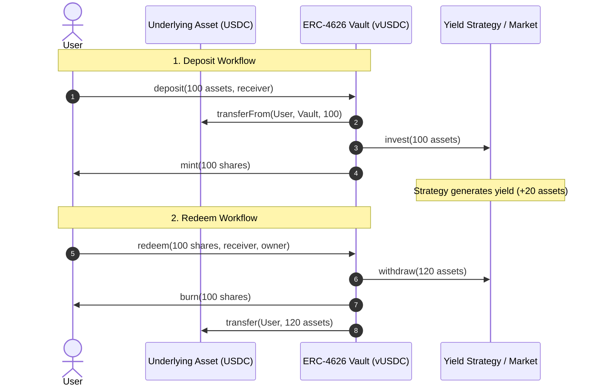

**ERC-4626** is the Ethereum standard for tokenized, yield-bearing vaults. Built as an extension of **ERC-20**, it creates a uniform interface for depositing assets, minting share tokens, earning yield, and redeeming underlying tokens.

<!--more-->

## 1. Why ERC-4626?

Before ERC-4626, every DeFi protocol built its own custom vault interface:
- Compound used `cTokens` with `mint()` / `redeem()`
- Aave used `aTokens`
- Yearn used `yVaults` with `deposit()` / `withdraw()`

This fragmentation forced aggregators, routers, and lending protocols to write custom adapters for every single protocol. ERC-4626 standardizes vault token mechanics across the entire EVM ecosystem.

---

## 2. Core Concepts & Math

An ERC-4626 system manages two types of tokens:

1. **Underlying Asset**: The base ERC-20 token being deposited (e.g. USDC, WETH, DAI).
2. **Vault Share**: The ERC-20 token minted by the vault representing fractional ownership of the vault's total assets.

### Pricing and Conversion Formulas

The exchange rate between shares and assets floats over time as yield accrues or losses occur:

$$\text{Share Price} = \frac{\text{Total Assets in Vault}}{\text{Total Shares Outstanding}}$$

- **Asset to Shares Conversion (Depositing/Minting)**:
  $$\text{Shares to Mint} = \frac{\text{Assets Deposited} \times \text{Total Shares}}{\text{Total Assets}}$$

- **Share to Asset Conversion (Withdrawing/Redeeming)**:
  $$\text{Assets to Return} = \frac{\text{Shares Burned} \times \text{Total Assets}}{\text{Total Shares}}$$

---

## 3. Step-by-Step Example & Data Flow

### Scenario
- **Underlying Asset**: USDC
- **Vault Token**: vUSDC
- **Initial State**: Vault is empty (0 assets, 0 shares).

```
Step 1: Alice deposits 100 USDC.
Step 2: Vault generates 20 USDC in yield via lending/staking strategy.
Step 3: Bob deposits 60 USDC.
Step 4: Alice redeems all 100 vUSDC shares.
```

### State Table

| Step | Action | Total Assets | Total Shares | Share Price | Alice Balance | Bob Balance |
| :--- | :--- | :--- | :--- | :--- | :--- | :--- |
| **0** | Initial State | `0 USDC` | `0 vUSDC` | `1.00 USDC` | 100 USDC | 60 USDC |
| **1** | Alice deposits `100 USDC` | `100 USDC` | `100 vUSDC` | `1.00 USDC` | 100 vUSDC | 60 USDC |
| **2** | Strategy earns `20 USDC` yield | `120 USDC` | `100 vUSDC` | **`1.20 USDC`** | 100 vUSDC | 60 USDC |
| **3** | Bob deposits `60 USDC` | `180 USDC` | `150 vUSDC` | `1.20 USDC` | 100 vUSDC | 50 vUSDC |
| **4** | Alice redeems `100 vUSDC` | `60 USDC` | `50 vUSDC` | `1.20 USDC` | **120 USDC** | 50 vUSDC |

### Key Takeaways
- Alice deposited **100 USDC** and redeemed **120 USDC** (+20 USDC profit).
- Bob deposited **60 USDC** when shares were valued at $1.20, receiving **50 vUSDC**.
- Bob's 50 shares are currently worth $50 \times 1.20 = 60\text{ USDC}$, preserving fair value.

---

## 4. Workflows

### Deposit & Redeem Flow



---

## 5. Standard Interface

ERC-4626 provides complementary entry, exit, preview, and limit functions:

| Operation Category | Asset-Denominated (Exact Assets) | Share-Denominated (Exact Shares) |
| :--- | :--- | :--- |
| **Deposit / Entry** | `deposit(uint256 assets, address receiver) -> uint256 shares` | `mint(uint256 shares, address receiver) -> uint256 assets` |
| **Withdraw / Exit** | `withdraw(uint256 assets, address receiver, address owner) -> uint256 shares` | `redeem(uint256 shares, address receiver, address owner) -> uint256 assets` |
| **Simulation** | `previewDeposit(assets)` / `previewWithdraw(assets)` | `previewMint(shares)` / `previewRedeem(shares)` |
| **Conversion** | `convertToShares(assets)` | `convertToAssets(shares)` |
| **Limits** | `maxDeposit(receiver)` / `maxWithdraw(owner)` | `maxMint(receiver)` / `maxRedeem(owner)` |
| **Accounting** | `asset() -> address` | `totalAssets() -> uint256` |

---

## 6. Key Security Considerations

1. **Inflation / First-Depositor Attack**:
   - An attacker deposits 1 wei of assets, receives 1 share, then donates a large amount directly to the vault (inflating `totalAssets()` relative to `totalSupply()`).
   - Subsequent depositors suffer extreme rounding errors down to 0 shares.
   - **Mitigations**: OpenZeppelin's ERC-4626 uses **virtual shares and virtual assets** (offset basis points) or dead share burning to prevent inflation manipulation.

2. **Rounding Direction (Per Spec)**:
   - Vault implementations must round in favor of the vault (down when converting assets to shares on deposit; down when converting shares to assets on redeem) to prevent drain vectors.

3. **Asynchronous Vaults (EIP-7540)**:
   - For real-world assets (RWA) or cross-chain strategies requiring settlement periods, EIP-7540 extends ERC-4626 with asynchronous request/claim queues.
