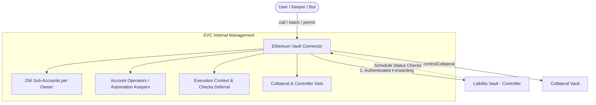
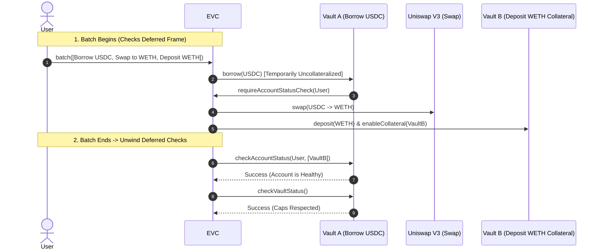

The **Ethereum Vault Connector (EVC)** is a foundational coordination layer for decentralized lending. It mediates interactions between independent ERC-4626 vaults, unifying liquidity, risk evaluation, batching, sub-accounts, and collateral control into a single protocol-agnostic primitive.

<!--more-->

## 1. Core Philosophy: Authentication vs. Authorisation

Monolithic protocols mix authentication, debt accounting, and risk rules in one contract. EVC cleanly separates these roles:

- **EVC (Authentication)**: Verifies caller identity, resolves sub-accounts and operators, tracks collateral/controller sets, and defers liquidity status checks.
- **Vaults (Authorisation & Accounting)**: Verify caller balances, calculate interest, evaluate pricing oracles, enforce LTV limits, and execute asset transfers.

---

## 2. Core Concepts: Controllers & Collaterals

### Collateral Set
A list of up to 10 vaults an account deposits into and enables as backing collateral via `enableCollateral(vault)`. Users can remove them with `disableCollateral(vault)` as long as all health checks pass.

- **`reorderCollaterals`**: Allows users to re-order their collateral array so higher-value collaterals are priced first, enabling controller vaults to short-circuit iteration loops and save gas.

### Controller Vault (Liability)
When an account borrows from a vault, it must call `enableController(vault)`.
- **Single Controller Invariant**: An account can have **at most one active controller** at the end of a transaction.
- **Collateral Lock**: Once a controller is enabled, the account cannot withdraw collateral or disable collaterals without controller approval.
- **Release**: Only the controller itself can invoke `disableController` (usually upon full loan repayment).

---

## 3. Checks Deferral & Flash Liquidity

A primary innovation of EVC is native **Checks Deferral**:

1. **Transient Violations Allowed**: Operations (borrow before deposit, withdraw before repay) can temporarily leave an account or vault insolvent.
2. **End-of-Batch Verification**: When the outermost execution context unwinds:
   - Evaluates `accountStatusChecks` on each recorded controller.
   - Evaluates `vaultStatusChecks` for global supply/borrow caps.
3. **No Flash Loan Fees**: Native checks deferral acts as generalized flash liquidity across any EVC vault.

---

## 4. Virtual Sub-Accounts & Operators

### 256 Sub-Accounts
- Each Ethereum address automatically controls **256 distinct virtual sub-account addresses**.
- Derived by bit-masking the first 19 bytes of the owner address:
  $$\text{SubAccount} = (\text{Owner} \ \& \ \neg\text{0xFF}) \ \vert \ \text{SubAccountIndex}$$
- Allows users to isolate risky leveraged positions across multiple controllers without deploying separate smart wallets.

### Operators (Programmable Delegation)
Owners can assign **Operators** (`setOperator(subAccount, operator, authorized)`). Operators can execute calls on behalf of the sub-account, enabling:
- Automated stop-loss / take-profit keeper bots.
- Intent-based trading architectures.
- Coordinated multi-vault rebalancing.

---

## 5. Execution Entry Points

| Function | Purpose | Permissions |
| :--- | :--- | :--- |
| `call(vault, onBehalfOf, value, data)` | Executes an authenticated single call | Caller must be Owner or Operator |
| `batch(items[])` | Executes an atomic array of arbitrary calls with deferred checks | Caller must be Owner or Operator |
| `controlCollateral(collateral, violator, data)` | Allows a controller to seize/withdraw collateral on a violator's behalf | Caller must be the enabled **Controller** |
| `permit(signer, sender, nonceNamespace, nonce, deadline, value, data, signature)` | Executes signed gasless meta-transactions (ECDSA / ERC-1271) | Anyone (relayed by Keeper) |

### Nonce Namespaces for Gasless Permits
`permit` includes `nonceNamespace` + `nonce`:
- **Sequential Execution**: Use `nonceNamespace = 0` with incrementing nonces.
- **Out-of-Order / Parallel Execution**: Use unique `nonceNamespace` values derived from order hashes with `nonce = 0`.

---

## 6. Security & Safety Modes

1. **`LOCKDOWN MODE`**:
   - Emergency switch triggered by an owner to freeze all accounts simultaneously.
   - Blocks external contract calls and permits; only allows operator revocations and nonce cancellations.
2. **`PERMIT DISABLED MODE`**:
   - Instantly invalidates all signed permit messages for an owner.
3. **Zero-Privilege Contract Rule**:
   - The EVC is an unprivileged router. It holds **no persistent funds, tokens, or admin keys**.
4. **Transient Storage (EIP-1153)**:
   - Execution contexts and deferred check queues are stored in transient storage where available, lowering gas costs.
