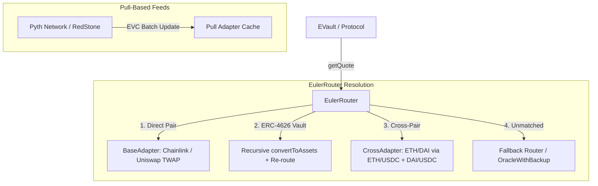

The **Euler Price Oracle** is an on-chain, composable pricing framework. It abstracts differences between push/pull oracles, handles currency decimals natively via quote-based queries, supports bid-ask uncertainty spreads, and resolves ERC-4626 vault share pricing recursively.

<!--more-->

## 1. Why Quote-Based Pricing?

Traditional oracle interfaces (like Chainlink `latestRoundData`) return fractional unit prices (e.g. $P = 0.000008936$ for SHIB/USDC). 

In EVM fixed-point math, unit prices introduce severe rounding errors:
- If SHIB is priced in USDC (6 decimals), converting 1 unit of SHIB ($10^{-18}$) into USDC ($10^{-6}$) yields `0` or `1` wei, losing all granular price movement.

### The Quote Paradigm
Instead of returning price fractions, `IPriceOracle` accepts an `inAmount` of the base token and returns the hypothetical swapped `outAmount` of the quote token:

$$\text{outAmount} = \text{Oracle.getQuote}(\text{inAmount}, \text{baseToken}, \text{quoteToken})$$

- **Decimal Abstraction**: Eliminates manual token decimal scaling by callers.
- **Precision Preservation**: Querying quotes with actual loan/collateral amounts preserves full integer precision.
- **Direct Valuation**: Directly answers *"How much USDC is 2.5 WETH worth?"* without intermediate floating-point division.

---

## 2. The `IPriceOracle` Interface

```solidity
interface IPriceOracle {
    function name() external view returns (string memory);

    /// @notice Single-sided / Mid-point price quote
    function getQuote(
        uint256 inAmount,
        address base,
        address quote
    ) external view returns (uint256 outAmount);

    /// @notice Two-sided bid/ask price quote
    function getQuotes(
        uint256 inAmount,
        address base,
        address quote
    ) external view returns (uint256 bidOutAmount, uint256 askOutAmount);
}
```

### ISO 4217 Currency Representation
Non-token assets (fiat currencies, gold) are cast directly to synthetic Ethereum addresses using their [ISO 4217](https://en.wikipedia.org/wiki/ISO_4217) numeric codes with a fixed **18-decimal convention**:
- **USD** (ISO 840) $\to$ `address(840)` (`0x0000000000000000000000000000000000000348`)
- **EUR** (ISO 978) $\to$ `address(978)`
- **GBP** (ISO 826) $\to$ `address(826)`

---

## 3. Bid-Ask Spreads & Dynamic Risk Management

Fair market value is inherently an uncertainty interval. The `getQuotes()` function outputs a bid and ask bounding box:

$$\text{Bid} \le \text{Mid-Point} \le \text{Ask}$$

```
                Mid-Point (getQuote)
                        |
[------ Bid ------] <---*---> [------ Ask ------]
  (Rounded Down)                (Rounded Up)
```

### Application in Lending Markets
Euler Vault Kit uses two-sided quotes to create **Dynamic LTV Buffers**:

| Context | Valuation Formula | Mechanism & Purpose |
| :--- | :--- | :--- |
| **Borrow / Collateral Check** | $\text{Collateral}_{\text{Bid}} \times \text{LTV} \ge \text{Liability}_{\text{Ask}}$ | Underestimates collateral (bid) and overestimates debt (ask). Widened spreads dynamically lower maximum borrowing leverage during volatility. |
| **Liquidation Check** | $\text{Collateral}_{\text{Mid}} \times \text{LiquidationLTV} < \text{Liability}_{\text{Mid}}$ | Evaluates at the mid-point (`getQuote`), preventing liquidations caused by momentary market spread widening. |

- **Rounding Invariant**: Bid quotes always round **down**; Ask quotes always round **up** (pessimizing conversion values in favor of protocol safety).

---

## 4. Modular Architecture & Routing Engine



### 4.1 Adapters (Push vs. Pull)
- **Push-Based Adapters**: Query on-chain feeds updated by third parties (Chainlink aggregators, Uniswap v3 TWAPs).
- **Pull-Based Adapters**: Read cached price updates posted within the same EVC batch (Pyth, RedStone signed payloads).
- **Bidirectionality**: Every adapter for pair $A/B$ automatically supports $B/A$.

### 4.2 `EulerRouter` & ERC-4626 Share Resolution
When queried for vault share tokens (`eToken`), `EulerRouter` natively evaluates:
1. Calls `eToken.convertToAssets(shares)` to obtain the underlying asset quantity.
2. Changes the `base` token to the underlying asset.
3. Recursively resolves the underlying asset's price through the router table.

### 4.3 `CrossAdapter`
Chains two intermediate oracle feeds that share a common asset (e.g. calculating `ETH/DAI` by composing `ETH/USDC` with `DAI/USDC`).

---

## 5. Risk Sentinels & Safety Wrappers

The repository provides composable safety modules wrapping standard oracles:

1. **`SequencerLivenessSentinel`**: Reverts queries on L2 rollups (Arbitrum, Optimism, Base) if the sequencer uptime feed indicates an active downtime or restart grace period.
2. **`RateGrowthSentinel`**: Detects anomalous price velocities and halts quotes if a rate moves faster than configured percentage thresholds.
3. **`AnchoredOracle`**: Compares a primary fast oracle against a slow, manipulation-resistant anchor (e.g. Chainlink vs. 30-min TWAP). Reverts if deviation exceeds tolerance.
4. **`LowHighOracle`**: Combines multiple independent feeds, outputting the minimum quote as the bid and the maximum quote as the ask.
5. **`OracleWithBackup`**: Catches revert errors from a primary oracle provider and transparently fails over to a secondary backup feed.

---

## 6. Key Engineering Summary

1. **Quote-Centric API**: Eliminates decimal conversion bugs and eliminates fixed-point rounding loss for extreme value assets (e.g. SHIB, meme tokens).
2. **Spread-Aware Risk Engine**: Bid/Ask spread width reflects real-time oracle confidence, enforcing conservative borrowing conditions without penalizing existing borrowers.
3. **Recursive Vault Unwrapping**: Seamlessly values yield-bearing ERC-4626 vault shares without requiring separate standalone price feeds.
4. **Composable Sentinels**: Layered defenses (L2 sequencer checks, rate-growth limits, TWAP anchors) can be attached to any standard adapter without modifying core lending contracts.
