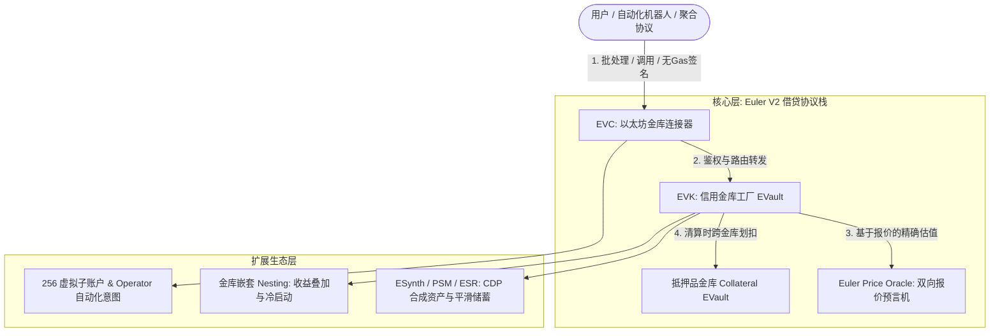

全面解析 **Euler V2** —— 以模块化、无许可与高可组合性为核心的以太坊去中心化借贷基础设施协议栈。

<!--more-->

## 1. 什么是 Euler V2？

传统的 DeFi 借贷协议（如 Aave、Compound v2）大多采用**单体共享流动性池（Pooled Liquidity）**架构，所有抵押品与借贷资产共担系统性风险。一旦某个长尾或受操纵的抵押品发生坏账，整个借贷池都会受到波及。

**Euler V2** 彻底摒弃了单体架构，演进为**模块化信用协议栈与金库工厂（Modular Lending Infrastructure & Vault Factory）**。

### 核心三位一体架构

| 架构层级 | 对应核心合约 | 核心职责与分工 |
| :--- | :--- | :--- |
| **认证与调度中枢** | **EVC** (*Ethereum Vault Connector*) | 统一用户认证、管理 256 个虚拟子账户、操作批处理、延迟健康检查（原生闪电流动性）、清算时跨金库扣划抵押品。 |
| **记账与信贷规则** | **EVK** (*Euler Vault Kit*) | 隔离的 ERC-4626 信用金库工厂、单资产债务记账、SPY 秒级复利、双重 LTV、虚拟存款防通胀攻击、反向荷兰拍卖清算。 |
| **定价与风险量化** | **Euler Price Oracle** | 基于“兑换输出量”（Quote-based）的精确计价体系、买卖价差（Bid/Ask）动态量化市场波动、递归解析 ERC-4626 金库份额价值。 |

---

## 2. 核心技术创新与产品特点

### 2.1 风险彻底隔离与自由建池（Permissionless & Isolated Risk）
- **零系统性扩散风险**：每个信用金库（`EVault`）只管理单一底层资产。即便某个长尾抵押品发生价格崩塌或坏账，损失仅局限在将其列为抵押品的具体金库中，不会影响协议全局。
- **完全自由定制**：任何人都可以无许可部署金库，自由配置抵押品白名单、LTV 比例、预言机与利率模型（IRM），亦可将管理权限移交给 `address(0)` 实现 100% 不可变运行。

### 2.2 原生检查延迟与零费率闪电流动性（Checks Deferral & Flash Liquidity）
- **允许交易中间态资不抵债**：EVC 允许在单个批处理（Batch）内部**暂时处于违约或超限状态**（例如：先借出 USDC $\to$ 在 DEX 兑换 WETH $\to$ 存入 WETH 抵押品）。
- **退栈全局审计**：所有操作执行完成后，EVC 统一触发 `checkAccountStatus` 与 `checkVaultStatus`。这提供了零手续费的原生闪电流动性，极大方便了跨金库加杠杆、仓位转移与闪电重平衡。

### 2.3 256 虚拟子账户与可编程 Operator 代理
- **虚拟子账户**：单个以太坊钱包原生拥有 **256 个独立的虚拟子账户**，无需部署多重签名钱包即可实现高风险杠杆仓位与低风险借贷仓位的物理隔离。
- **Operator 授权代理**：用户可将特定子账户委托给智能合约（Operator），在无需转移资产所有权的前提下实现链上自动止损、止盈网格、限价委托与 Intent 意图交易。

### 2.4 动态风险缓冲：双重 LTV 与买卖价差（Bid-Ask Spreads）
- **双重 LTV 机制**：
  - **借款 LTV（Borrow LTV）**：严格限制**新借款**的开仓杠杆；
  - **清算 LTV（Liquidation LTV）**：宽容评估**已有借款**，吸收预言机更新延迟与短暂波动。
- **价差动态缩杠杆**：借款时以最悲观价格计价（抵押品按 Bid 报价、债务按 Ask 报价），当市场波动剧烈导致价差拉大时，系统自动降低可借杠杆：
  $$\text{Collateral}_{\text{Bid}} \times \text{LTV} \ge \text{Liability}_{\text{Ask}}$$

### 2.5 反向荷兰拍卖清算（Reverse Dutch Auction）
- 清算罚金折价与账户违约深度成正比（违约越轻折价越低，最高不超过 `maxLiquidationDiscount`）。
- 彻底改变了传统借贷协议固定 5%~10% 高额清算罚金导致的恶意 MEV 抢跑与借款人本金超额损失，最大化保护借款人权益。

### 2.6 金库份额递归嵌套与冷启动（Vault Nesting）
- 借贷金库的份额代币（`eTokenA`）本身完全兼容 ERC-4626 标准。
- `eTokenA` 可直接作为另一个高阶金库（`eTokenB`）的底层资产，形成**收益叠加**：
  $$\text{总复利收益} = (1 + \text{Yield}_A) \times (1 + \text{Yield}_B) - 1$$
- 为新上线的小众长尾资产借贷市场提供基础流动性冷启动能力。

---

## 3. 主流 DeFi 借贷协议横向对比

| 核心维度 | Aave v3 | Morpho Blue | Euler V2 |
| :--- | :--- | :--- | :--- |
| **市场拓扑** | 单体多资产共享流动性池 | 极简双代币借贷对 ($1:1$) | **隔离式多抵押品信用金库 ($N:1$)** |
| **闪电流动性** | 外部 FlashLoan (收取 0.05% 费用) | 原生 Callback 机制 | **原生延迟检查 Checks Deferral (0% 费率)** |
| **子账户隔离** | 不支持 | 不支持 | **原生 256 个虚拟子账户** |
| **预言机体系** | 传统推式 Unit 价格 (Chainlink) | 独立单点预言机 | **Quote 报价 + Bid/Ask 动态价差量化** |
| **清算机制** | 固定清算罚金 ($5\%\text{--}10\%$) | 阶梯/固定清算系数 | **反向荷兰拍卖 (折价随违约深度动态上升)** |
| **存储工程** | 多槽位独立 Mapping 存储 | 基础结构体存储 | **单槽位 256 位极限压缩打包** |

---

## 4. 总结

Euler V2 构建了 **Web3 去中心化信贷的“乐高工厂”**：
它通过 **EVC 解决了流动性割裂与多池交互复杂性**，通过 **EVK 建立了标准化、模块化且抗通胀攻击的借贷记账单元**，并通过 **Euler Price Oracle 构筑了严密的动态风险定价防线**。
