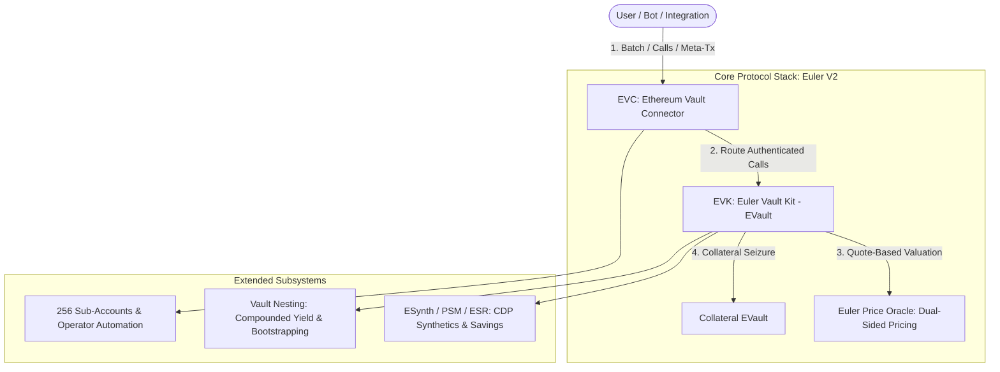

A complete architectural synthesis of **Euler V2** — a modular, permissionless, and composable lending infrastructure on Ethereum.

<!--more-->

## 1. What is Euler V2?

Unlike monolithic lending protocols (e.g. Aave, Compound) where all collateral and debt share a pooled risk model, **Euler V2** is a **modular credit infrastructure and vault factory**.

It breaks decentralized lending into distinct, decoupled layers:

### The Three Pillars

| Pillar | Contract / Component | Primary Responsibility |
| :--- | :--- | :--- |
| **Authentication & Routing** | **EVC** (*Ethereum Vault Connector*) | Identity resolution, 256 virtual sub-accounts, batching, checks deferral (native flash liquidity), and collateral control during liquidations. |
| **Accounting & Credit Rules** | **EVK** (*Euler Vault Kit*) | Isolated ERC-4626 credit vaults, single-token debt tracking, SPY per-second compounding, dual LTVs, virtual deposit inflation defenses, and Dutch liquidations. |
| **Pricing & Uncertainty Engine** | **Euler Price Oracle** | Quote-based swap pricing (eliminating decimal errors), bid-ask spread dynamic risk buffers, recursive ERC-4626 share valuation, and safety sentinels. |

---

## 2. Key Product Innovations

### 2.1 Isolated Risk & Permissionless Market Creation
- **Zero Cross-Contamination**: Each vault supports a single underlying asset. Bad debt in a niche collateral pool cannot cascade into the broader protocol.
- **Full Customizability**: Anyone can deploy custom credit vaults with tailored LTVs, oracles, IRMs, and caps, or finalize ownership (`governor = address(0)`) for 100% immutable execution.

### 2.2 Native Checks Deferral (Zero-Fee Flash Liquidity)
- **Temporary Insolvent States**: The EVC allows an execution batch to temporarily violate solvency (e.g. borrow asset $\to$ swap on DEX $\to$ deposit collateral) as long as account and vault constraints pass when unwinding at the end of the batch.
- **Built-in Flash Liquidity**: Enables seamless position refinancing, leverage looping, and collateral swapping without paying flash-loan fees.

### 2.3 256 Virtual Sub-Accounts & Operator Automation
- **Sub-Accounts**: Every address natively controls 256 virtual accounts derived from its address prefix, allowing clean separation between high-leverage and passive lending positions.
- **Operators**: Users can grant fine-grained execution permissions to smart contracts (e.g. stop-loss bots, limit-order keepers, intent engines) without transferring asset ownership.

### 2.4 Dynamic Risk Buffers: Dual LTVs & Bid-Ask Spreads
- **Dual LTV Framework**:
  - **Borrowing LTV**: Restricts *new* debt creation.
  - **Liquidation LTV**: Protects *existing* debt against oracle latency.
- **Spread-Aware Leveraged Limits**: Oracles return Bid/Ask quotes. During high volatility, widened spreads automatically compress the maximum allowable borrowing leverage:
  $$\text{Collateral}_{\text{Bid}} \times \text{LTV} \ge \text{Liability}_{\text{Ask}}$$

### 2.5 Reverse Dutch Auction Liquidations
- Liquidation discounts scale proportionally with violation severity ($\text{Discount} \propto \text{Violation Depth}$).
- Eliminates fixed liquidation penalty spikes, protects borrower equity during minor price dips, and neutralizes toxic MEV front-running.

### 2.6 Vault Nesting & Yield Compounding
- Yield-bearing shares (`eTokenA`) can serve as the underlying asset for a specialized credit vault (`eTokenB`).
- Depositors earn multiplied yield:
  $$\text{Total Yield} = (1 + \text{Yield}_A) \times (1 + \text{Yield}_B) - 1$$
- Solves cold-start liquidity for exotic lending pairs.

---

## 3. DeFi Lending Architecture Comparison

| Feature | Aave v3 | Morpho Blue | Euler V2 |
| :--- | :--- | :--- | :--- |
| **Market Topology** | Pooled Liquidity | Isolated Pairs ($1:1$) | **Isolated Multi-Collateral Vaults ($N:1$)** |
| **Flash Liquidity** | External Flash Loan ($0.05\%$ fee) | Native Callback | **Native Checks Deferral (0% fee)** |
| **Sub-Accounts** | Not Supported | Not Supported | **256 Native Sub-Accounts per address** |
| **Oracle Strategy** | Push-based (Chainlink) | Custom single oracle | **Quote-based + Bid/Ask Dynamic Spread** |
| **Liquidations** | Fixed Bonus ($5\text{--}10\%$) | Fixed LDM Bonus | **Reverse Dutch Auction (Dynamic %)** |
| **Account Storage** | Multi-slot mappings | Multi-slot struct | **Single-Slot Packing (256-bit total)** |

---

## 4. Key Takeaway

Euler V2 establishes a **composable lending foundation**. By decoupling **authentication (EVC)**, **accounting (EVK)**, and **pricing (Price Oracle)**, it provides the efficiency of a unified lending pool alongside the security of fully isolated credit markets.
