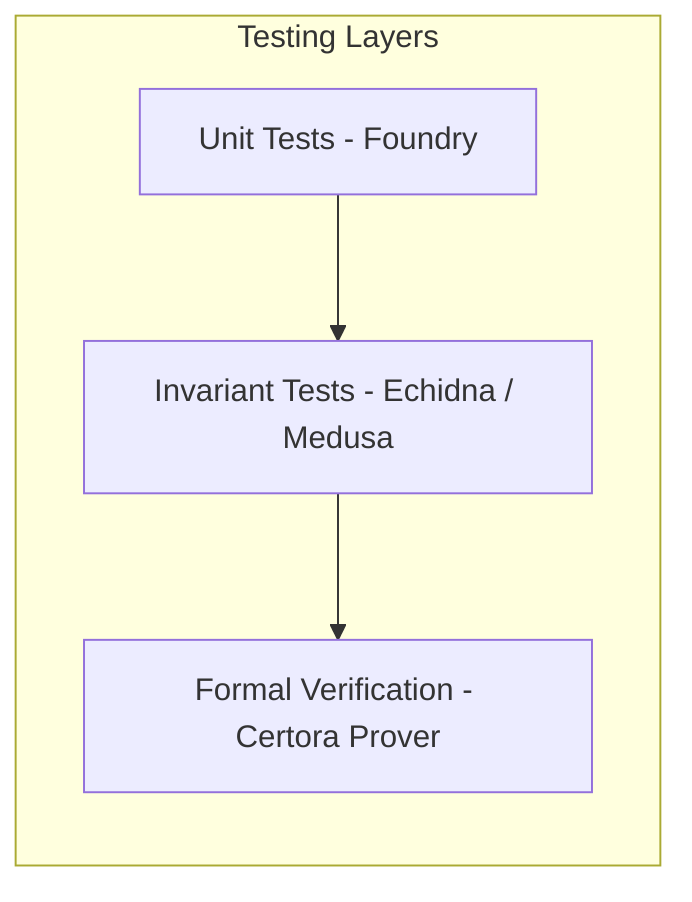

A comprehensive code-level review and technical breakdown of the [`euler-vault-kit`](https://github.com/euler-xyz/euler-vault-kit) repository.

<!--more-->

## 1. Repository Overview & Directory Map

The `euler-vault-kit` repository is structured into isolated smart contract modules, factory proxies, synthetic asset mechanisms, and an exhaustive verification suite (Foundry, Echidna/Medusa invariant harnesses, and Certora Prover formal specs).

```
src/
├── EVault/                   # Core lending vault implementation
│   ├── EVault.sol            # Top-level dispatcher contract
│   ├── Dispatch.sol          # Module routing & EVC interception logic
│   ├── DToken.sol            # Read-only ERC-20 debt tracker sidecar
│   ├── modules/              # Logic modules (invoked via delegatecall)
│   │   ├── Vault.sol         # ERC-4626 core (deposit, withdraw, mint, redeem, skim)
│   │   ├── Borrowing.sol     # Borrow, repay, pullDebt, flashLoan, cash accounting
│   │   ├── Liquidation.sol   # Reverse Dutch auction liquidation & collateral seizure
│   │   ├── RiskManager.sol   # EVC account/vault health checks & liquidity queries
│   │   ├── Token.sol         # ERC-20 share token transfers and approvals
│   │   ├── Governance.sol    # LTV config, caps, hook settings, fee parameters
│   │   ├── BalanceForwarder.sol # Balance tracking hooks for external reward streams
│   │   └── Initialize.sol    # Post-deployment initialization
│   └── shared/               # Storage structs, custom types, and math libraries
├── GenericFactory/           # Permissionless factory for Beacon and MetaProxies
├── Synths/                   # CDP synthetic asset system (ESynth, ESR, PSM, IRMSynth)
├── InterestRateModels/       # SPY kink-based IRMs
├── ProtocolConfig/           # Euler DAO fee configuration contract
└── SequenceRegistry/         # Monotonic unique symbol generation (eUSDC-1)
```

---

## 2. Deep Dive: Core Components & Module Breakdown

### 2.1 The Dispatcher Pattern (`EVault.sol` & `Dispatch.sol`)
To stay well under the Ethereum $24\text{ KB}$ contract size limit while keeping high runtime gas efficiency, `EVault` acts as a static dispatcher:

```solidity
// High-frequency functions are inlined directly in EVault:
function balanceOf(address account) public view override returns (uint256) { 
    return super.balanceOf(account); 
}

// Write functions delegatecall to external static modules:
function deposit(uint256 amount, address receiver) 
    public override callThroughEVC use(MODULE_VAULT) returns (uint256) {}

// View functions execute via staticcall -> delegatecall workaround:
function totalAssets() 
    public view override useView(MODULE_VAULT) returns (uint256) {}
```

#### The `useView` Trick
Solidity prohibits `delegatecall` inside `view` functions. EVK solves this by having `useView` perform a `staticcall` back to `this.viewDelegate()`, which executes the `delegatecall` inside a read-only environment:

```
External Caller ──> totalAssets() [view]
                        │
                        └──> staticcall(this.viewDelegate)
                                  │
                                  └──> delegatecall(MODULE_VAULT.totalAssets)
```

#### `callThroughEVC` Modifier
Ensures that whenever a user interacts directly with the vault (rather than through the EVC), the vault intercepts the call and forwards it to `EVC.call(address(this), ...)` so that account status and liquidity checks are always deferred to the end of the batch.

---

### 2.2 Storage Layout & Custom Types (`src/EVault/shared/types/`)
EVK avoids conversion errors and minimizes storage slots using user-defined value types and tight bit-packing:

| Type | Underlying Type | Purpose | Packing / Constraints |
| :--- | :--- | :--- | :--- |
| `Assets` | `uint112` | Underlying token amount | Max $2^{112}-1$ (`MAX_SANE_AMOUNT`) |
| `Shares` | `uint112` | Vault share token amount | Fits in 112 bits |
| `Owed` | `uint144` | Liability debt amount | Scaled with 31-bit precision shift |
| `AmountCap` | `uint16` | Supply & borrow limits | Decimal floating point format |
| `ConfigAmount` | `uint16` | LTVs & fee shares | Fixed point $[0..1]$ scaled by 10,000 |

#### Single-Slot Account Storage (`UserStorage.sol`)
An entire user position (shares, debt, and balance tracking status) is packed into **one single 32-byte storage slot**:

```
 256                         144                 32                0 (bits)
  ├─── 1 bit ─────────────────┼───── 143 bits ────┼──── 112 bits ───┤
  │ BalanceForwarder Enabled  │    Owed (Debt)    │  Shares Balance │
  └───────────────────────────┴───────────────────┴─────────────────┘
```

---

### 2.3 Factory & Proxy Architecture (`src/GenericFactory/`)

The `GenericFactory` supports two deployment options:
1. **BeaconProxy**: Upgradeable proxy pointing to the factory as the beacon. Upgrades are controlled by `upgradeAdmin`.
2. **MetaProxy (EIP-3448 Inspired)**: Minimal immutable proxy that stores constructor arguments (e.g. underlying asset, EVC address) directly in calldata trailing bytes rather than proxy storage, significantly reducing deployment and read gas costs.

---

### 2.4 Synthetic Asset System (`src/Synths/`)

A CDP-based stablecoin / synthetic asset framework:

1. **`ESynth.sol`**: EVC-compatible ERC-20 token. Supports minter capacities, flash loans, and dynamic `totalSupply` adjustments that exclude uncirculated protocol allocations and vault interest.
2. **`IRMSynth.sol`**: Reactive interest rate model. If the synthetic market price drops below the target peg quote, it increases borrow rates by $+10\%$ per interval to discourage borrowing and induce repayments; if above peg, it lowers the rate.
3. **`EulerSavingsRate.sol` (ESR)**: ERC-4626 vault with a `gulp()` mechanism that smears distributed yield over rolling 2-week periods to prevent donation front-running.
4. **`PegStabilityModule.sol` (PSM)**: Provides zero-slippage 1:1 conversions between collateral assets and the synthetic token up to configured mint caps.

---

## 3. Verification & Quality Assurance Suite

EVK features one of the most comprehensive verification pipelines in DeFi:



### 1. Invariant & Fuzz Testing (`test/invariants/`)
- Uses modular handlers (`VaultModuleHandler`, `BorrowingModuleHandler`, `LiquidationModuleHandler`) simulating concurrent user actions, oracle fluctuations, flash loans, and donation attacks.
- Integrated with **Echidna** and **Medusa** fuzzers using custom assertion properties (`ProtocolAssertions.sol`).

### 2. Certora Formal Verification (`certora/specs/`)
Formally verified mathematical proofs covering critical protocol invariants:
- **`VaultERC4626.spec`**: Proof of solvency ($\text{totalAssets} \ge \text{totalSupply}$), monotonicity of deposits/redemptions, and zero-loss conversions.
- **`HealthStatusInvariant.spec`**: Proof that no sequence of operations can leave an un-liquidatable violating account undetected.
- **`GhostPow.spec`**: Correctness proof for the per-second compounding `rpow` exponentiation math.

---

## 4. Key Architectural Takeaways

1. **Modular Dispatcher + MetaProxy**: Provides the gas efficiency of monolithic contracts with the clean separation of modular design, fitting within bytecode limits.
2. **Virtual Offsets for ERC-4626**: Prevents inflation attacks permanently by factoring a virtual deposit baseline into exchange rate queries.
3. **Dual LTV Buffering**: Decouples new borrowing limits from liquidation thresholds to neutralize pull-oracle latency exploits.
4. **Single-Slot State Packing**: Drastically minimizes warm/cold storage SLOAD and SSTORE gas costs by packing shares, debts, and flags into 256 bits.
