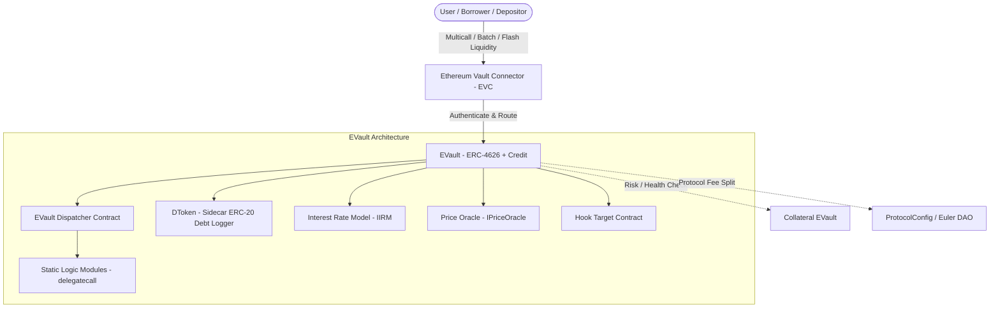
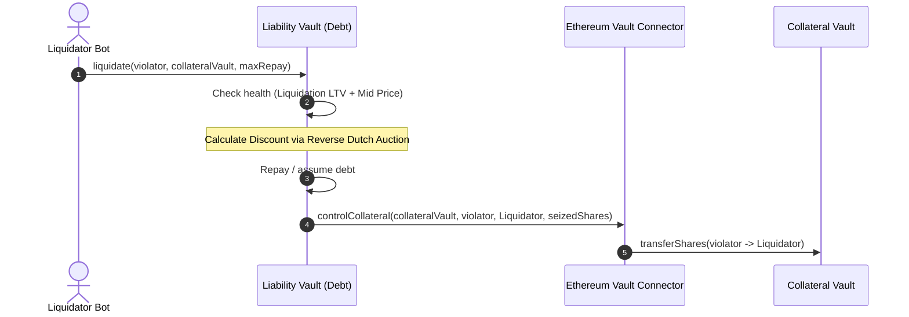

The **Euler Vault Kit (EVK)** is a modular framework for constructing **credit vaults** on Ethereum. It turns passive ERC-4626 yield vaults into composable, isolated lending markets coordinated by the **Ethereum Vault Connector (EVC)**.

<!--more-->

## 1. System Architecture & Philosophy

Monolithic lending platforms (e.g. Compound v2, Aave) combine all assets into a single shared-liquidity pool where any bad asset risks the whole system. EVK replaces this with **isolated, customizable credit vaults**.



### Separation of Concerns
- **EVC (Ethereum Vault Connector)**: Handles **Authentication**, account collateral sets, sub-accounts (up to 256 per EOA), operation batching, and deferred health checks (flash liquidity).
- **`EVault`**: Handles **Authorization & Accounting** for a single underlying ERC-20 token (deposits, borrows, repayments, liquidations, interest).
- **`DToken`**: Read-only ERC-20 sidecar emitting debt transfer logs for indexers and explorers.

---

## 2. Vault Creation & Governance Matrix

EVK supports both active curation and immutable execution across two orthogonal choices:

| Configuration | Upgradeable (Beacon Proxy) | Immutable (MetaProxy / EIP-3448) |
| :--- | :--- | :--- |
| **Governed** | Factory Admin + Vault Governor | Vault Governor only |
| **Finalised (`governor = address(0)`)** | Factory Admin only | **Pure Ungoverned Code (Zero Admin Risk)** |

- **Fork-Exec Initialisation**: Newly deployed vaults start with all operations disabled (`hookTarget = address(0)`). The creator batches configuration settings, then either retains or revokes governance (`address(0)`).
- **Sequence Registry**: Automatically generates deterministic symbols such as `eUSDC-1`.

---

## 3. Core Accounting & Exchange Rates

### Pricing Formula & Virtual Deposits
EVK protects against the first-depositor inflation attack using synthetic **virtual deposits** ($1:1$ ratio):

$$\text{Exchange Rate} = \frac{\text{Cash} + \text{Total Borrows} + \text{VIRTUAL\_DEPOSIT}}{\text{Total Shares} + \text{VIRTUAL\_DEPOSIT}}$$

- **Internal Balance Tracking**: Vaults track `cash` in contract storage rather than querying `balanceOf(address(this))`. Direct token donations do not manipulate the share price; excess tokens are retrieved via `skim()`.
- **Rounding Rules**:
  - Redemptions round **down** (fewer assets returned).
  - Withdrawals round **up** (more shares burned).
  - Debt calculations round **up** (borrowers owe more).
  - *All rounding favors the vault.*

---

## 4. Interest Rates & Fee Economics

### Compounding with Second Percent Yield (SPY)
- Interest accrues per second using exact exponentiation (`rpow`) scaled by $10^{27}$.
- **Batch Optimization**: When multiple actions occur in one EVC batch, the Interest Rate Model (IRM) is queried **once** at the batch conclusion during `checkVaultStatus`.

### Fee Mechanism & ProtocolConfig
- **Reserve Dilution**: Interest fees mint new shares to dilute suppliers by the `interestFee` proportion. Unclaimed fee shares continuously earn vault interest.
- **DAO Fee Boundary**: `ProtocolConfig` can claim up to a maximum of $50\%$ of the governor's accrued interest fees.

---

## 5. Risk Management: Dual LTVs & Ramping

Each liability vault independently configures accepted collateral vaults and their Loan-To-Value (LTV) limits.

```
0.0                                Borrow LTV             Liquidation LTV         1.0
 |--------------------------------------|------------------------|-----------------|
 [            Healthy Zone             ] [  No-Borrow Buffer   ] [ Liquidation Zone ]
```

### Why Dual LTVs?
1. **Borrowing LTV**: Restricts **new** debt creation during `checkAccountStatus`.
2. **Liquidation LTV**: Sets the trigger threshold for **existing** debt during liquidations.
3. **Safety Buffer**: Absorbs oracle update lag and temporary bid-ask volatility without immediately liquidating healthy borrowers.

### LTV Ramping
When a governor lowers a liquidation LTV, they can define a **ramp duration**. The liquidation LTV decreases linearly over time, avoiding sudden liquidation cascades and giving borrowers time to rebalance.

```
Liquidation LTV
    ^
80% |----\ (Initial LTV)
    |     \
60% |      \=======> (Linear downward slope over ramp duration)
    |               \
    +----------------------------------> Time
```

### Dual-Sided Oracle Quotes (`getQuotes`)
- **Borrow Checks**: Evaluated using **Bid for collateral** and **Ask for debt** (spread dynamically reduces maximum leverage).
- **Liquidation Checks**: Evaluated using the **Mid-point price** (`getQuote`), preventing liquidations triggered by temporary spread spikes.

---

## 6. Liquidation Engine



1. **Reverse Dutch Auction Discount**:
   $$\text{Discount} \propto \text{Violation Depth} \quad (\le \text{maxLiquidationDiscount})$$
   - Small violations incur low penalties, preserving borrower capital.
   - Deep violations increase the discount, guaranteeing liquidator execution.
2. **Cool-Off Period**:
   - Accounts cannot be liquidated within $N$ seconds of a successful health check.
   - Blocks pull-oracle sandwich exploits (manipulating stale prices, borrowing, updating price, and self-liquidating in the same block).
3. **Bad Debt Socialisation**:
   - If an insolvent position has all collateral seized but debt remains, the unpaid balance is written off across remaining depositors, preventing bank-run conditions.

---

## 7. Advanced Composition

### Perspectives (On-Chain Verification)
Perspectives serve as on-chain, verifiable filters for vault safety:
- **`0x Perspective` (Zero Governance Risk)**: Guarantees the vault and its recursive collateral tree are entirely immutable and finalised.
- **`Nzx Perspective`**: Allows verified, trusted governed vaults in the collateral tree.
- **`Escrowed Perspective`**: Verifies non-borrowing vaults used purely for collateral storage.

### Vault Nesting
A vault can accept shares from another Euler vault (`eTokenA`) as its underlying asset (`eTokenB`):

$$\text{Net Compound Yield} = (1 + \text{Yield}_A) \times (1 + \text{Yield}_B) - 1$$

- Solves cold-start liquidity bootstrapping: suppliers earn baseline yield on `eTokenA` while offering liquidity to specialized `eTokenB` markets.

---

## 8. Smart Contract Engineering Highlights

### Dispatcher & `useView` Pattern
To stay within the $24\text{ KB}$ contract size limit, `EVault` acts as a dispatcher routing calls to static logic modules:
- Direct execution for performance-critical functions.
- `delegatecall` via `use(MODULE)` for write operations.
- `staticcall` into `viewDelegate()` $\to$ `delegatecall` via `useView(MODULE)` for read-only view operations (bypassing Solidity's restrictions on view-level delegatecalls).

### Storage Packing & Types
- **`Assets` / `Shares`**: Stored as `uint112` ($2^{112}-1$).
- **`Owed` (Debt)**: Stored as `uint144` (includes a 31-bit precision shift for micro-interest accrual).
- Combines user share balances, debts, and balance forwarding flags into a **single 32-byte storage slot**.
